---
execute:
  echo: false
params:
  object: "tar.rds" # will have to be passed - will be a mandatory parameter  -> path to a rds export of a targeter object
  summary_object: ""  # if not empty, where summary objeect is stored. If emptuy we will recompute
  author: "welovedatascience - targeter"
  title: "targeter analyis"
  include_introduction: TRUE
  show_toc: TRUE
  show_tables: TRUE
  fullplot_which_plot: "1:2"
  fullplot_numvar_as: "bin" # 'bin', 'value'
  decision_tree: TRUE
  decision_tree_format: "static" # static, interactive
  metadata_var_field: "variable"
  metadata_var_label: "label"
  logo: "wlds-logo.png"
format:
  revealjs:
    smaller: true
    scrollable: true
    embed-resources: true
    slide-level: 3
  pptx:
    slide-level: 3
  html:
    theme: cosmo
    toc: true
    toc-location: left
    fontsize: 1.1em
    linestretch: 1.5
    title-block-banner: true
    smooth-scroll: true
    anchor-sections: true
    search: true
    embed-resources: true
  docx:
    toc: true
  pdf:
    toc: true
date: "2025-03-05"
title: "targeter analyis"
author: "welovedatascience - targeter"
logo: "wlds-logo.png"
reporty-type: targeter
---


::: {.cell}

:::

::: {.cell}

:::

::: {.cell}

:::


### Analysis parameters


- Data used: adult
- Descrition of data: no description provided.
- Analysis performed the: 2025-03-05
- Target: ABOVE50K  [binary]
- Number of variables: 12
- Analysed population contains: 32561 records.
- Analysis performed on: R version 4.4.2 (2024-10-31) with targeter 1.3.2


::: {.content-hidden unless-meta="params.include_introduction"}

<!-- TODO: adapt text to traget type -->


## Introduction

This report contains a snapshot of the specific subpopulation **«var: ABOVE50K » == 1`**. 

This subpopulation is characterized by  performing bivariate analyses, crossing the variable of interest (target) with  potential explanatory variables. Only most relevant (highest discriminative power) may be retained.

Report contains:

*   A summary overview table with selected retained criteria with some available information such as one statistic called information value (IV) that provides an idea of the explanatory power of the criteria.
*   Detailed analyses per criteria with graphics that highlight the reation between one of the candidate criteria and the _target_.

It can happen that one criteria contains some missing values. If such, we will introduce value *"[Missing]"* in the report, eventually with a cross **[x]**. Also, if two few data are available, we would use a minus **[-]** instead of reporting value. 

### Summary table interpretation

Criteria are sorted by decreasing importance order, which one is determined by the IV. 
One modality (value) index is also computed as the proportion of target «var: ABOVE50K» within the modality, that is the target penetration in the subpopulation selected by the specific modality of a criteria. A value near 1 would indicate a non-discriminative modality: selecting the corresponding subpopulation would result in the overall average target penetration. On the other way, the hightest the index (>1), the more target is over-representated in the subpopulation. Low index (<1) would be interpreted as under-representation. So high index modalities are of interest as they characterize subpopulation with high target penetration.

Note that index will always be computed for segments (modalities): continuous variables are cut into buckets. If a criteria/variable has no segment with any high index, it will not be of interest at all. Also, having one segment with an index  greater than 1 implies that there are counterparts segments with index lower 1.

There is no special rule to say that an index is a __good__ one as its interpretation has to take into account the natural (average) target pourcentage (penetration). Indeed, when the penetration is low, it is easier to observe eventually high index. Think that for a global penetration of 50% of target, maximal index is 2 (and more generally, index is bounded by `1/(target penetration)`)

For every criteria, summary table presents its possible value (modality) having the highest index along with the corresponding number of records. Pay attention that you might observe high index dealing with very restrictive sub-populations.


\newpage


:::


### Populations


- **Population**

  


No description of the global population (data) have been provided during the analysis.
 Analyzed population contains  32561  records.


- **Target**
  


No description of the target has been provided during the analysis.

Target used: var: ABOVE50K [ABOVE50K] 


 value   count   nNA   percNA        perc
------  ------  ----  -------  ----------
     0   24720     0        0   0.7591904
     1    7841     0        0   0.2408096


### Summary

::: {.cell}
::: {.cell-output-display}


``````{=openxml}
<p:graphicFrame xmlns:a="http://schemas.openxmlformats.org/drawingml/2006/main" xmlns:r="http://schemas.openxmlformats.org/officeDocument/2006/relationships" xmlns:p="http://schemas.openxmlformats.org/presentationml/2006/main"><p:nvGraphicFramePr><p:cNvPr id="344866218" name=""/><p:cNvGraphicFramePr><a:graphicFrameLocks noGrp="true"/></p:cNvGraphicFramePr><p:nvPr/></p:nvGraphicFramePr><p:xfrm rot="0"><a:off x="914400" y="1828800"/><a:ext cx="9144000" cy="5486400"/></p:xfrm><a:graphic><a:graphicData uri="http://schemas.openxmlformats.org/drawingml/2006/table"><a:tbl><a:tblPr/><a:tblGrid><a:gridCol w="1453203"/><a:gridCol w="929737"/><a:gridCol w="660706"/><a:gridCol w="1632944"/><a:gridCol w="942015"/><a:gridCol w="957704"/><a:gridCol w="647813"/></a:tblGrid><a:tr h="387922"><a:tc><a:txBody><a:bodyPr/><a:lstStyle/><a:p><a:pPr algn="l" marL="63500" marR="63500"><a:lnSpc><a:spcPct val="100000"/></a:lnSpc><a:spcBef><a:spcPts val="500" /></a:spcBef><a:spcAft><a:spcPts val="500" /></a:spcAft><a:buNone/></a:pPr><a:r><a:rPr cap="none" sz="1100" i="0" b="0" u="none"><a:solidFill><a:srgbClr val="000000"><a:alpha val="100000"/></a:srgbClr></a:solidFill><a:latin typeface="DejaVu Sans"/><a:cs typeface="DejaVu Sans"/><a:ea typeface="DejaVu Sans"/><a:sym typeface="DejaVu Sans"/></a:rPr><a:t>variable</a:t></a:r></a:p></a:txBody><a:tcPr anchor="ctr" marB="63500" marT="63500" marR="0" marL="0"><a:lnL algn="ctr" cmpd="sng" cap="flat" w="0"><a:noFill/><a:prstDash val="solid"/></a:lnL><a:lnR algn="ctr" cmpd="sng" cap="flat" w="0"><a:noFill/><a:prstDash val="solid"/></a:lnR><a:lnT algn="ctr" cmpd="sng" cap="flat" w="19050"><a:solidFill><a:srgbClr val="666666"><a:alpha val="100000"/></a:srgbClr></a:solidFill><a:prstDash val="solid"/></a:lnT><a:lnB algn="ctr" cmpd="sng" cap="flat" w="19050"><a:solidFill><a:srgbClr val="666666"><a:alpha val="100000"/></a:srgbClr></a:solidFill><a:prstDash val="solid"/></a:lnB><a:solidFill><a:srgbClr val="FFFFFF"><a:alpha val="0"/></a:srgbClr></a:solidFill></a:tcPr></a:tc><a:tc><a:txBody><a:bodyPr/><a:lstStyle/><a:p><a:pPr algn="l" marL="63500" marR="63500"><a:lnSpc><a:spcPct val="100000"/></a:lnSpc><a:spcBef><a:spcPts val="500" /></a:spcBef><a:spcAft><a:spcPts val="500" /></a:spcAft><a:buNone/></a:pPr><a:r><a:rPr cap="none" sz="1100" i="0" b="0" u="none"><a:solidFill><a:srgbClr val="000000"><a:alpha val="100000"/></a:srgbClr></a:solidFill><a:latin typeface="DejaVu Sans"/><a:cs typeface="DejaVu Sans"/><a:ea typeface="DejaVu Sans"/><a:sym typeface="DejaVu Sans"/></a:rPr><a:t>type</a:t></a:r></a:p></a:txBody><a:tcPr anchor="ctr" marB="63500" marT="63500" marR="0" marL="0"><a:lnL algn="ctr" cmpd="sng" cap="flat" w="0"><a:noFill/><a:prstDash val="solid"/></a:lnL><a:lnR algn="ctr" cmpd="sng" cap="flat" w="0"><a:noFill/><a:prstDash val="solid"/></a:lnR><a:lnT algn="ctr" cmpd="sng" cap="flat" w="19050"><a:solidFill><a:srgbClr val="666666"><a:alpha val="100000"/></a:srgbClr></a:solidFill><a:prstDash val="solid"/></a:lnT><a:lnB algn="ctr" cmpd="sng" cap="flat" w="19050"><a:solidFill><a:srgbClr val="666666"><a:alpha val="100000"/></a:srgbClr></a:solidFill><a:prstDash val="solid"/></a:lnB><a:solidFill><a:srgbClr val="FFFFFF"><a:alpha val="0"/></a:srgbClr></a:solidFill></a:tcPr></a:tc><a:tc><a:txBody><a:bodyPr/><a:lstStyle/><a:p><a:pPr algn="r" marL="63500" marR="63500"><a:lnSpc><a:spcPct val="100000"/></a:lnSpc><a:spcBef><a:spcPts val="500" /></a:spcBef><a:spcAft><a:spcPts val="500" /></a:spcAft><a:buNone/></a:pPr><a:r><a:rPr cap="none" sz="1100" i="0" b="0" u="none"><a:solidFill><a:srgbClr val="000000"><a:alpha val="100000"/></a:srgbClr></a:solidFill><a:latin typeface="DejaVu Sans"/><a:cs typeface="DejaVu Sans"/><a:ea typeface="DejaVu Sans"/><a:sym typeface="DejaVu Sans"/></a:rPr><a:t>IV</a:t></a:r></a:p></a:txBody><a:tcPr anchor="ctr" marB="63500" marT="63500" marR="0" marL="0"><a:lnL algn="ctr" cmpd="sng" cap="flat" w="0"><a:noFill/><a:prstDash val="solid"/></a:lnL><a:lnR algn="ctr" cmpd="sng" cap="flat" w="0"><a:noFill/><a:prstDash val="solid"/></a:lnR><a:lnT algn="ctr" cmpd="sng" cap="flat" w="19050"><a:solidFill><a:srgbClr val="666666"><a:alpha val="100000"/></a:srgbClr></a:solidFill><a:prstDash val="solid"/></a:lnT><a:lnB algn="ctr" cmpd="sng" cap="flat" w="19050"><a:solidFill><a:srgbClr val="666666"><a:alpha val="100000"/></a:srgbClr></a:solidFill><a:prstDash val="solid"/></a:lnB><a:solidFill><a:srgbClr val="FFFFFF"><a:alpha val="0"/></a:srgbClr></a:solidFill></a:tcPr></a:tc><a:tc><a:txBody><a:bodyPr/><a:lstStyle/><a:p><a:pPr algn="l" marL="63500" marR="63500"><a:lnSpc><a:spcPct val="100000"/></a:lnSpc><a:spcBef><a:spcPts val="500" /></a:spcBef><a:spcAft><a:spcPts val="500" /></a:spcAft><a:buNone/></a:pPr><a:r><a:rPr cap="none" sz="1100" i="0" b="0" u="none"><a:solidFill><a:srgbClr val="000000"><a:alpha val="100000"/></a:srgbClr></a:solidFill><a:latin typeface="DejaVu Sans"/><a:cs typeface="DejaVu Sans"/><a:ea typeface="DejaVu Sans"/><a:sym typeface="DejaVu Sans"/></a:rPr><a:t>Level</a:t></a:r></a:p></a:txBody><a:tcPr anchor="ctr" marB="63500" marT="63500" marR="0" marL="0"><a:lnL algn="ctr" cmpd="sng" cap="flat" w="0"><a:noFill/><a:prstDash val="solid"/></a:lnL><a:lnR algn="ctr" cmpd="sng" cap="flat" w="0"><a:noFill/><a:prstDash val="solid"/></a:lnR><a:lnT algn="ctr" cmpd="sng" cap="flat" w="19050"><a:solidFill><a:srgbClr val="666666"><a:alpha val="100000"/></a:srgbClr></a:solidFill><a:prstDash val="solid"/></a:lnT><a:lnB algn="ctr" cmpd="sng" cap="flat" w="19050"><a:solidFill><a:srgbClr val="666666"><a:alpha val="100000"/></a:srgbClr></a:solidFill><a:prstDash val="solid"/></a:lnB><a:solidFill><a:srgbClr val="FFFFFF"><a:alpha val="0"/></a:srgbClr></a:solidFill></a:tcPr></a:tc><a:tc><a:txBody><a:bodyPr/><a:lstStyle/><a:p><a:pPr algn="r" marL="63500" marR="63500"><a:lnSpc><a:spcPct val="100000"/></a:lnSpc><a:spcBef><a:spcPts val="500" /></a:spcBef><a:spcAft><a:spcPts val="500" /></a:spcAft><a:buNone/></a:pPr><a:r><a:rPr cap="none" sz="1100" i="0" b="0" u="none"><a:solidFill><a:srgbClr val="000000"><a:alpha val="100000"/></a:srgbClr></a:solidFill><a:latin typeface="DejaVu Sans"/><a:cs typeface="DejaVu Sans"/><a:ea typeface="DejaVu Sans"/><a:sym typeface="DejaVu Sans"/></a:rPr><a:t>#Records</a:t></a:r></a:p></a:txBody><a:tcPr anchor="ctr" marB="63500" marT="63500" marR="0" marL="0"><a:lnL algn="ctr" cmpd="sng" cap="flat" w="0"><a:noFill/><a:prstDash val="solid"/></a:lnL><a:lnR algn="ctr" cmpd="sng" cap="flat" w="0"><a:noFill/><a:prstDash val="solid"/></a:lnR><a:lnT algn="ctr" cmpd="sng" cap="flat" w="19050"><a:solidFill><a:srgbClr val="666666"><a:alpha val="100000"/></a:srgbClr></a:solidFill><a:prstDash val="solid"/></a:lnT><a:lnB algn="ctr" cmpd="sng" cap="flat" w="19050"><a:solidFill><a:srgbClr val="666666"><a:alpha val="100000"/></a:srgbClr></a:solidFill><a:prstDash val="solid"/></a:lnB><a:solidFill><a:srgbClr val="FFFFFF"><a:alpha val="0"/></a:srgbClr></a:solidFill></a:tcPr></a:tc><a:tc><a:txBody><a:bodyPr/><a:lstStyle/><a:p><a:pPr algn="r" marL="63500" marR="63500"><a:lnSpc><a:spcPct val="100000"/></a:lnSpc><a:spcBef><a:spcPts val="500" /></a:spcBef><a:spcAft><a:spcPts val="500" /></a:spcAft><a:buNone/></a:pPr><a:r><a:rPr cap="none" sz="1100" i="0" b="0" u="none"><a:solidFill><a:srgbClr val="000000"><a:alpha val="100000"/></a:srgbClr></a:solidFill><a:latin typeface="DejaVu Sans"/><a:cs typeface="DejaVu Sans"/><a:ea typeface="DejaVu Sans"/><a:sym typeface="DejaVu Sans"/></a:rPr><a:t>%Records</a:t></a:r></a:p></a:txBody><a:tcPr anchor="ctr" marB="63500" marT="63500" marR="0" marL="0"><a:lnL algn="ctr" cmpd="sng" cap="flat" w="0"><a:noFill/><a:prstDash val="solid"/></a:lnL><a:lnR algn="ctr" cmpd="sng" cap="flat" w="0"><a:noFill/><a:prstDash val="solid"/></a:lnR><a:lnT algn="ctr" cmpd="sng" cap="flat" w="19050"><a:solidFill><a:srgbClr val="666666"><a:alpha val="100000"/></a:srgbClr></a:solidFill><a:prstDash val="solid"/></a:lnT><a:lnB algn="ctr" cmpd="sng" cap="flat" w="19050"><a:solidFill><a:srgbClr val="666666"><a:alpha val="100000"/></a:srgbClr></a:solidFill><a:prstDash val="solid"/></a:lnB><a:solidFill><a:srgbClr val="FFFFFF"><a:alpha val="0"/></a:srgbClr></a:solidFill></a:tcPr></a:tc><a:tc><a:txBody><a:bodyPr/><a:lstStyle/><a:p><a:pPr algn="r" marL="63500" marR="63500"><a:lnSpc><a:spcPct val="100000"/></a:lnSpc><a:spcBef><a:spcPts val="500" /></a:spcBef><a:spcAft><a:spcPts val="500" /></a:spcAft><a:buNone/></a:pPr><a:r><a:rPr cap="none" sz="1100" i="0" b="0" u="none"><a:solidFill><a:srgbClr val="000000"><a:alpha val="100000"/></a:srgbClr></a:solidFill><a:latin typeface="DejaVu Sans"/><a:cs typeface="DejaVu Sans"/><a:ea typeface="DejaVu Sans"/><a:sym typeface="DejaVu Sans"/></a:rPr><a:t>Index</a:t></a:r></a:p></a:txBody><a:tcPr anchor="ctr" marB="63500" marT="63500" marR="0" marL="0"><a:lnL algn="ctr" cmpd="sng" cap="flat" w="0"><a:noFill/><a:prstDash val="solid"/></a:lnL><a:lnR algn="ctr" cmpd="sng" cap="flat" w="0"><a:noFill/><a:prstDash val="solid"/></a:lnR><a:lnT algn="ctr" cmpd="sng" cap="flat" w="19050"><a:solidFill><a:srgbClr val="666666"><a:alpha val="100000"/></a:srgbClr></a:solidFill><a:prstDash val="solid"/></a:lnT><a:lnB algn="ctr" cmpd="sng" cap="flat" w="19050"><a:solidFill><a:srgbClr val="666666"><a:alpha val="100000"/></a:srgbClr></a:solidFill><a:prstDash val="solid"/></a:lnB><a:solidFill><a:srgbClr val="FFFFFF"><a:alpha val="0"/></a:srgbClr></a:solidFill></a:tcPr></a:tc></a:tr><a:tr h="368891"><a:tc><a:txBody><a:bodyPr/><a:lstStyle/><a:p><a:pPr algn="l" marL="63500" marR="63500"><a:lnSpc><a:spcPct val="100000"/></a:lnSpc><a:spcBef><a:spcPts val="500" /></a:spcBef><a:spcAft><a:spcPts val="500" /></a:spcAft><a:buNone/></a:pPr><a:r><a:rPr cap="none" sz="1100" i="0" b="0" u="none"><a:solidFill><a:srgbClr val="000000"><a:alpha val="100000"/></a:srgbClr></a:solidFill><a:latin typeface="DejaVu Sans"/><a:cs typeface="DejaVu Sans"/><a:ea typeface="DejaVu Sans"/><a:sym typeface="DejaVu Sans"/></a:rPr><a:t>RELATIONSHIP</a:t></a:r></a:p></a:txBody><a:tcPr anchor="ctr" marB="63500" marT="63500" marR="0" marL="0"><a:lnL algn="ctr" cmpd="sng" cap="flat" w="0"><a:noFill/><a:prstDash val="solid"/></a:lnL><a:lnR algn="ctr" cmpd="sng" cap="flat" w="0"><a:noFill/><a:prstDash val="solid"/></a:lnR><a:lnT algn="ctr" cmpd="sng" cap="flat" w="0"><a:noFill/><a:prstDash val="solid"/></a:lnT><a:lnB algn="ctr" cmpd="sng" cap="flat" w="0"><a:noFill/><a:prstDash val="solid"/></a:lnB><a:solidFill><a:srgbClr val="FFFFFF"><a:alpha val="0"/></a:srgbClr></a:solidFill></a:tcPr></a:tc><a:tc><a:txBody><a:bodyPr/><a:lstStyle/><a:p><a:pPr algn="l" marL="63500" marR="63500"><a:lnSpc><a:spcPct val="100000"/></a:lnSpc><a:spcBef><a:spcPts val="500" /></a:spcBef><a:spcAft><a:spcPts val="500" /></a:spcAft><a:buNone/></a:pPr><a:r><a:rPr cap="none" sz="1100" i="0" b="0" u="none"><a:solidFill><a:srgbClr val="000000"><a:alpha val="100000"/></a:srgbClr></a:solidFill><a:latin typeface="DejaVu Sans"/><a:cs typeface="DejaVu Sans"/><a:ea typeface="DejaVu Sans"/><a:sym typeface="DejaVu Sans"/></a:rPr><a:t>character</a:t></a:r></a:p></a:txBody><a:tcPr anchor="ctr" marB="63500" marT="63500" marR="0" marL="0"><a:lnL algn="ctr" cmpd="sng" cap="flat" w="0"><a:noFill/><a:prstDash val="solid"/></a:lnL><a:lnR algn="ctr" cmpd="sng" cap="flat" w="0"><a:noFill/><a:prstDash val="solid"/></a:lnR><a:lnT algn="ctr" cmpd="sng" cap="flat" w="0"><a:noFill/><a:prstDash val="solid"/></a:lnT><a:lnB algn="ctr" cmpd="sng" cap="flat" w="0"><a:noFill/><a:prstDash val="solid"/></a:lnB><a:solidFill><a:srgbClr val="FFFFFF"><a:alpha val="0"/></a:srgbClr></a:solidFill></a:tcPr></a:tc><a:tc><a:txBody><a:bodyPr/><a:lstStyle/><a:p><a:pPr algn="r" marL="63500" marR="63500"><a:lnSpc><a:spcPct val="100000"/></a:lnSpc><a:spcBef><a:spcPts val="500" /></a:spcBef><a:spcAft><a:spcPts val="500" /></a:spcAft><a:buNone/></a:pPr><a:r><a:rPr cap="none" sz="1100" i="0" b="0" u="none"><a:solidFill><a:srgbClr val="000000"><a:alpha val="100000"/></a:srgbClr></a:solidFill><a:latin typeface="DejaVu Sans"/><a:cs typeface="DejaVu Sans"/><a:ea typeface="DejaVu Sans"/><a:sym typeface="DejaVu Sans"/></a:rPr><a:t>1.536</a:t></a:r></a:p></a:txBody><a:tcPr anchor="ctr" marB="63500" marT="63500" marR="0" marL="0"><a:lnL algn="ctr" cmpd="sng" cap="flat" w="0"><a:noFill/><a:prstDash val="solid"/></a:lnL><a:lnR algn="ctr" cmpd="sng" cap="flat" w="0"><a:noFill/><a:prstDash val="solid"/></a:lnR><a:lnT algn="ctr" cmpd="sng" cap="flat" w="0"><a:noFill/><a:prstDash val="solid"/></a:lnT><a:lnB algn="ctr" cmpd="sng" cap="flat" w="0"><a:noFill/><a:prstDash val="solid"/></a:lnB><a:solidFill><a:srgbClr val="FFFFFF"><a:alpha val="0"/></a:srgbClr></a:solidFill></a:tcPr></a:tc><a:tc><a:txBody><a:bodyPr/><a:lstStyle/><a:p><a:pPr algn="l" marL="63500" marR="63500"><a:lnSpc><a:spcPct val="100000"/></a:lnSpc><a:spcBef><a:spcPts val="500" /></a:spcBef><a:spcAft><a:spcPts val="500" /></a:spcAft><a:buNone/></a:pPr><a:r><a:rPr cap="none" sz="1100" i="0" b="0" u="none"><a:solidFill><a:srgbClr val="000000"><a:alpha val="100000"/></a:srgbClr></a:solidFill><a:latin typeface="DejaVu Sans"/><a:cs typeface="DejaVu Sans"/><a:ea typeface="DejaVu Sans"/><a:sym typeface="DejaVu Sans"/></a:rPr><a:t> Wife</a:t></a:r></a:p></a:txBody><a:tcPr anchor="ctr" marB="63500" marT="63500" marR="0" marL="0"><a:lnL algn="ctr" cmpd="sng" cap="flat" w="0"><a:noFill/><a:prstDash val="solid"/></a:lnL><a:lnR algn="ctr" cmpd="sng" cap="flat" w="0"><a:noFill/><a:prstDash val="solid"/></a:lnR><a:lnT algn="ctr" cmpd="sng" cap="flat" w="0"><a:noFill/><a:prstDash val="solid"/></a:lnT><a:lnB algn="ctr" cmpd="sng" cap="flat" w="0"><a:noFill/><a:prstDash val="solid"/></a:lnB><a:solidFill><a:srgbClr val="FFFFFF"><a:alpha val="0"/></a:srgbClr></a:solidFill></a:tcPr></a:tc><a:tc><a:txBody><a:bodyPr/><a:lstStyle/><a:p><a:pPr algn="r" marL="63500" marR="63500"><a:lnSpc><a:spcPct val="100000"/></a:lnSpc><a:spcBef><a:spcPts val="500" /></a:spcBef><a:spcAft><a:spcPts val="500" /></a:spcAft><a:buNone/></a:pPr><a:r><a:rPr cap="none" sz="1100" i="0" b="0" u="none"><a:solidFill><a:srgbClr val="000000"><a:alpha val="100000"/></a:srgbClr></a:solidFill><a:latin typeface="DejaVu Sans"/><a:cs typeface="DejaVu Sans"/><a:ea typeface="DejaVu Sans"/><a:sym typeface="DejaVu Sans"/></a:rPr><a:t>745</a:t></a:r></a:p></a:txBody><a:tcPr anchor="ctr" marB="63500" marT="63500" marR="0" marL="0"><a:lnL algn="ctr" cmpd="sng" cap="flat" w="0"><a:noFill/><a:prstDash val="solid"/></a:lnL><a:lnR algn="ctr" cmpd="sng" cap="flat" w="0"><a:noFill/><a:prstDash val="solid"/></a:lnR><a:lnT algn="ctr" cmpd="sng" cap="flat" w="0"><a:noFill/><a:prstDash val="solid"/></a:lnT><a:lnB algn="ctr" cmpd="sng" cap="flat" w="0"><a:noFill/><a:prstDash val="solid"/></a:lnB><a:solidFill><a:srgbClr val="FFFFFF"><a:alpha val="0"/></a:srgbClr></a:solidFill></a:tcPr></a:tc><a:tc><a:txBody><a:bodyPr/><a:lstStyle/><a:p><a:pPr algn="r" marL="63500" marR="63500"><a:lnSpc><a:spcPct val="100000"/></a:lnSpc><a:spcBef><a:spcPts val="500" /></a:spcBef><a:spcAft><a:spcPts val="500" /></a:spcAft><a:buNone/></a:pPr><a:r><a:rPr cap="none" sz="1100" i="0" b="0" u="none"><a:solidFill><a:srgbClr val="000000"><a:alpha val="100000"/></a:srgbClr></a:solidFill><a:latin typeface="DejaVu Sans"/><a:cs typeface="DejaVu Sans"/><a:ea typeface="DejaVu Sans"/><a:sym typeface="DejaVu Sans"/></a:rPr><a:t>47.51</a:t></a:r></a:p></a:txBody><a:tcPr anchor="ctr" marB="63500" marT="63500" marR="0" marL="0"><a:lnL algn="ctr" cmpd="sng" cap="flat" w="0"><a:noFill/><a:prstDash val="solid"/></a:lnL><a:lnR algn="ctr" cmpd="sng" cap="flat" w="0"><a:noFill/><a:prstDash val="solid"/></a:lnR><a:lnT algn="ctr" cmpd="sng" cap="flat" w="0"><a:noFill/><a:prstDash val="solid"/></a:lnT><a:lnB algn="ctr" cmpd="sng" cap="flat" w="0"><a:noFill/><a:prstDash val="solid"/></a:lnB><a:solidFill><a:srgbClr val="FFFFFF"><a:alpha val="0"/></a:srgbClr></a:solidFill></a:tcPr></a:tc><a:tc><a:txBody><a:bodyPr/><a:lstStyle/><a:p><a:pPr algn="r" marL="63500" marR="63500"><a:lnSpc><a:spcPct val="100000"/></a:lnSpc><a:spcBef><a:spcPts val="500" /></a:spcBef><a:spcAft><a:spcPts val="500" /></a:spcAft><a:buNone/></a:pPr><a:r><a:rPr cap="none" sz="1100" i="0" b="0" u="none"><a:solidFill><a:srgbClr val="000000"><a:alpha val="100000"/></a:srgbClr></a:solidFill><a:latin typeface="DejaVu Sans"/><a:cs typeface="DejaVu Sans"/><a:ea typeface="DejaVu Sans"/><a:sym typeface="DejaVu Sans"/></a:rPr><a:t>1.97</a:t></a:r></a:p></a:txBody><a:tcPr anchor="ctr" marB="63500" marT="63500" marR="0" marL="0"><a:lnL algn="ctr" cmpd="sng" cap="flat" w="0"><a:noFill/><a:prstDash val="solid"/></a:lnL><a:lnR algn="ctr" cmpd="sng" cap="flat" w="0"><a:noFill/><a:prstDash val="solid"/></a:lnR><a:lnT algn="ctr" cmpd="sng" cap="flat" w="0"><a:noFill/><a:prstDash val="solid"/></a:lnT><a:lnB algn="ctr" cmpd="sng" cap="flat" w="0"><a:noFill/><a:prstDash val="solid"/></a:lnB><a:solidFill><a:srgbClr val="FFFFFF"><a:alpha val="0"/></a:srgbClr></a:solidFill></a:tcPr></a:tc></a:tr><a:tr h="395971"><a:tc><a:txBody><a:bodyPr/><a:lstStyle/><a:p><a:pPr algn="l" marL="63500" marR="63500"><a:lnSpc><a:spcPct val="100000"/></a:lnSpc><a:spcBef><a:spcPts val="500" /></a:spcBef><a:spcAft><a:spcPts val="500" /></a:spcAft><a:buNone/></a:pPr><a:r><a:rPr cap="none" sz="1100" i="0" b="0" u="none"><a:solidFill><a:srgbClr val="000000"><a:alpha val="100000"/></a:srgbClr></a:solidFill><a:latin typeface="DejaVu Sans"/><a:cs typeface="DejaVu Sans"/><a:ea typeface="DejaVu Sans"/><a:sym typeface="DejaVu Sans"/></a:rPr><a:t>MARITALSTATUS</a:t></a:r></a:p></a:txBody><a:tcPr anchor="ctr" marB="63500" marT="63500" marR="0" marL="0"><a:lnL algn="ctr" cmpd="sng" cap="flat" w="0"><a:noFill/><a:prstDash val="solid"/></a:lnL><a:lnR algn="ctr" cmpd="sng" cap="flat" w="0"><a:noFill/><a:prstDash val="solid"/></a:lnR><a:lnT algn="ctr" cmpd="sng" cap="flat" w="0"><a:noFill/><a:prstDash val="solid"/></a:lnT><a:lnB algn="ctr" cmpd="sng" cap="flat" w="0"><a:noFill/><a:prstDash val="solid"/></a:lnB><a:solidFill><a:srgbClr val="FFFFFF"><a:alpha val="0"/></a:srgbClr></a:solidFill></a:tcPr></a:tc><a:tc><a:txBody><a:bodyPr/><a:lstStyle/><a:p><a:pPr algn="l" marL="63500" marR="63500"><a:lnSpc><a:spcPct val="100000"/></a:lnSpc><a:spcBef><a:spcPts val="500" /></a:spcBef><a:spcAft><a:spcPts val="500" /></a:spcAft><a:buNone/></a:pPr><a:r><a:rPr cap="none" sz="1100" i="0" b="0" u="none"><a:solidFill><a:srgbClr val="000000"><a:alpha val="100000"/></a:srgbClr></a:solidFill><a:latin typeface="DejaVu Sans"/><a:cs typeface="DejaVu Sans"/><a:ea typeface="DejaVu Sans"/><a:sym typeface="DejaVu Sans"/></a:rPr><a:t>character</a:t></a:r></a:p></a:txBody><a:tcPr anchor="ctr" marB="63500" marT="63500" marR="0" marL="0"><a:lnL algn="ctr" cmpd="sng" cap="flat" w="0"><a:noFill/><a:prstDash val="solid"/></a:lnL><a:lnR algn="ctr" cmpd="sng" cap="flat" w="0"><a:noFill/><a:prstDash val="solid"/></a:lnR><a:lnT algn="ctr" cmpd="sng" cap="flat" w="0"><a:noFill/><a:prstDash val="solid"/></a:lnT><a:lnB algn="ctr" cmpd="sng" cap="flat" w="0"><a:noFill/><a:prstDash val="solid"/></a:lnB><a:solidFill><a:srgbClr val="FFFFFF"><a:alpha val="0"/></a:srgbClr></a:solidFill></a:tcPr></a:tc><a:tc><a:txBody><a:bodyPr/><a:lstStyle/><a:p><a:pPr algn="r" marL="63500" marR="63500"><a:lnSpc><a:spcPct val="100000"/></a:lnSpc><a:spcBef><a:spcPts val="500" /></a:spcBef><a:spcAft><a:spcPts val="500" /></a:spcAft><a:buNone/></a:pPr><a:r><a:rPr cap="none" sz="1100" i="0" b="0" u="none"><a:solidFill><a:srgbClr val="000000"><a:alpha val="100000"/></a:srgbClr></a:solidFill><a:latin typeface="DejaVu Sans"/><a:cs typeface="DejaVu Sans"/><a:ea typeface="DejaVu Sans"/><a:sym typeface="DejaVu Sans"/></a:rPr><a:t>1.339</a:t></a:r></a:p></a:txBody><a:tcPr anchor="ctr" marB="63500" marT="63500" marR="0" marL="0"><a:lnL algn="ctr" cmpd="sng" cap="flat" w="0"><a:noFill/><a:prstDash val="solid"/></a:lnL><a:lnR algn="ctr" cmpd="sng" cap="flat" w="0"><a:noFill/><a:prstDash val="solid"/></a:lnR><a:lnT algn="ctr" cmpd="sng" cap="flat" w="0"><a:noFill/><a:prstDash val="solid"/></a:lnT><a:lnB algn="ctr" cmpd="sng" cap="flat" w="0"><a:noFill/><a:prstDash val="solid"/></a:lnB><a:solidFill><a:srgbClr val="FFFFFF"><a:alpha val="0"/></a:srgbClr></a:solidFill></a:tcPr></a:tc><a:tc><a:txBody><a:bodyPr/><a:lstStyle/><a:p><a:pPr algn="l" marL="63500" marR="63500"><a:lnSpc><a:spcPct val="100000"/></a:lnSpc><a:spcBef><a:spcPts val="500" /></a:spcBef><a:spcAft><a:spcPts val="500" /></a:spcAft><a:buNone/></a:pPr><a:r><a:rPr cap="none" sz="1100" i="0" b="0" u="none"><a:solidFill><a:srgbClr val="000000"><a:alpha val="100000"/></a:srgbClr></a:solidFill><a:latin typeface="DejaVu Sans"/><a:cs typeface="DejaVu Sans"/><a:ea typeface="DejaVu Sans"/><a:sym typeface="DejaVu Sans"/></a:rPr><a:t> Married-civ-spouse</a:t></a:r></a:p></a:txBody><a:tcPr anchor="ctr" marB="63500" marT="63500" marR="0" marL="0"><a:lnL algn="ctr" cmpd="sng" cap="flat" w="0"><a:noFill/><a:prstDash val="solid"/></a:lnL><a:lnR algn="ctr" cmpd="sng" cap="flat" w="0"><a:noFill/><a:prstDash val="solid"/></a:lnR><a:lnT algn="ctr" cmpd="sng" cap="flat" w="0"><a:noFill/><a:prstDash val="solid"/></a:lnT><a:lnB algn="ctr" cmpd="sng" cap="flat" w="0"><a:noFill/><a:prstDash val="solid"/></a:lnB><a:solidFill><a:srgbClr val="FFFFFF"><a:alpha val="0"/></a:srgbClr></a:solidFill></a:tcPr></a:tc><a:tc><a:txBody><a:bodyPr/><a:lstStyle/><a:p><a:pPr algn="r" marL="63500" marR="63500"><a:lnSpc><a:spcPct val="100000"/></a:lnSpc><a:spcBef><a:spcPts val="500" /></a:spcBef><a:spcAft><a:spcPts val="500" /></a:spcAft><a:buNone/></a:pPr><a:r><a:rPr cap="none" sz="1100" i="0" b="0" u="none"><a:solidFill><a:srgbClr val="000000"><a:alpha val="100000"/></a:srgbClr></a:solidFill><a:latin typeface="DejaVu Sans"/><a:cs typeface="DejaVu Sans"/><a:ea typeface="DejaVu Sans"/><a:sym typeface="DejaVu Sans"/></a:rPr><a:t>6,692</a:t></a:r></a:p></a:txBody><a:tcPr anchor="ctr" marB="63500" marT="63500" marR="0" marL="0"><a:lnL algn="ctr" cmpd="sng" cap="flat" w="0"><a:noFill/><a:prstDash val="solid"/></a:lnL><a:lnR algn="ctr" cmpd="sng" cap="flat" w="0"><a:noFill/><a:prstDash val="solid"/></a:lnR><a:lnT algn="ctr" cmpd="sng" cap="flat" w="0"><a:noFill/><a:prstDash val="solid"/></a:lnT><a:lnB algn="ctr" cmpd="sng" cap="flat" w="0"><a:noFill/><a:prstDash val="solid"/></a:lnB><a:solidFill><a:srgbClr val="FFFFFF"><a:alpha val="0"/></a:srgbClr></a:solidFill></a:tcPr></a:tc><a:tc><a:txBody><a:bodyPr/><a:lstStyle/><a:p><a:pPr algn="r" marL="63500" marR="63500"><a:lnSpc><a:spcPct val="100000"/></a:lnSpc><a:spcBef><a:spcPts val="500" /></a:spcBef><a:spcAft><a:spcPts val="500" /></a:spcAft><a:buNone/></a:pPr><a:r><a:rPr cap="none" sz="1100" i="0" b="0" u="none"><a:solidFill><a:srgbClr val="000000"><a:alpha val="100000"/></a:srgbClr></a:solidFill><a:latin typeface="DejaVu Sans"/><a:cs typeface="DejaVu Sans"/><a:ea typeface="DejaVu Sans"/><a:sym typeface="DejaVu Sans"/></a:rPr><a:t>44.68</a:t></a:r></a:p></a:txBody><a:tcPr anchor="ctr" marB="63500" marT="63500" marR="0" marL="0"><a:lnL algn="ctr" cmpd="sng" cap="flat" w="0"><a:noFill/><a:prstDash val="solid"/></a:lnL><a:lnR algn="ctr" cmpd="sng" cap="flat" w="0"><a:noFill/><a:prstDash val="solid"/></a:lnR><a:lnT algn="ctr" cmpd="sng" cap="flat" w="0"><a:noFill/><a:prstDash val="solid"/></a:lnT><a:lnB algn="ctr" cmpd="sng" cap="flat" w="0"><a:noFill/><a:prstDash val="solid"/></a:lnB><a:solidFill><a:srgbClr val="FFFFFF"><a:alpha val="0"/></a:srgbClr></a:solidFill></a:tcPr></a:tc><a:tc><a:txBody><a:bodyPr/><a:lstStyle/><a:p><a:pPr algn="r" marL="63500" marR="63500"><a:lnSpc><a:spcPct val="100000"/></a:lnSpc><a:spcBef><a:spcPts val="500" /></a:spcBef><a:spcAft><a:spcPts val="500" /></a:spcAft><a:buNone/></a:pPr><a:r><a:rPr cap="none" sz="1100" i="0" b="0" u="none"><a:solidFill><a:srgbClr val="000000"><a:alpha val="100000"/></a:srgbClr></a:solidFill><a:latin typeface="DejaVu Sans"/><a:cs typeface="DejaVu Sans"/><a:ea typeface="DejaVu Sans"/><a:sym typeface="DejaVu Sans"/></a:rPr><a:t>1.86</a:t></a:r></a:p></a:txBody><a:tcPr anchor="ctr" marB="63500" marT="63500" marR="0" marL="0"><a:lnL algn="ctr" cmpd="sng" cap="flat" w="0"><a:noFill/><a:prstDash val="solid"/></a:lnL><a:lnR algn="ctr" cmpd="sng" cap="flat" w="0"><a:noFill/><a:prstDash val="solid"/></a:lnR><a:lnT algn="ctr" cmpd="sng" cap="flat" w="0"><a:noFill/><a:prstDash val="solid"/></a:lnT><a:lnB algn="ctr" cmpd="sng" cap="flat" w="0"><a:noFill/><a:prstDash val="solid"/></a:lnB><a:solidFill><a:srgbClr val="FFFFFF"><a:alpha val="0"/></a:srgbClr></a:solidFill></a:tcPr></a:tc></a:tr><a:tr h="395971"><a:tc><a:txBody><a:bodyPr/><a:lstStyle/><a:p><a:pPr algn="l" marL="63500" marR="63500"><a:lnSpc><a:spcPct val="100000"/></a:lnSpc><a:spcBef><a:spcPts val="500" /></a:spcBef><a:spcAft><a:spcPts val="500" /></a:spcAft><a:buNone/></a:pPr><a:r><a:rPr cap="none" sz="1100" i="0" b="0" u="none"><a:solidFill><a:srgbClr val="000000"><a:alpha val="100000"/></a:srgbClr></a:solidFill><a:latin typeface="DejaVu Sans"/><a:cs typeface="DejaVu Sans"/><a:ea typeface="DejaVu Sans"/><a:sym typeface="DejaVu Sans"/></a:rPr><a:t>AGE</a:t></a:r></a:p></a:txBody><a:tcPr anchor="ctr" marB="63500" marT="63500" marR="0" marL="0"><a:lnL algn="ctr" cmpd="sng" cap="flat" w="0"><a:noFill/><a:prstDash val="solid"/></a:lnL><a:lnR algn="ctr" cmpd="sng" cap="flat" w="0"><a:noFill/><a:prstDash val="solid"/></a:lnR><a:lnT algn="ctr" cmpd="sng" cap="flat" w="0"><a:noFill/><a:prstDash val="solid"/></a:lnT><a:lnB algn="ctr" cmpd="sng" cap="flat" w="0"><a:noFill/><a:prstDash val="solid"/></a:lnB><a:solidFill><a:srgbClr val="FFFFFF"><a:alpha val="0"/></a:srgbClr></a:solidFill></a:tcPr></a:tc><a:tc><a:txBody><a:bodyPr/><a:lstStyle/><a:p><a:pPr algn="l" marL="63500" marR="63500"><a:lnSpc><a:spcPct val="100000"/></a:lnSpc><a:spcBef><a:spcPts val="500" /></a:spcBef><a:spcAft><a:spcPts val="500" /></a:spcAft><a:buNone/></a:pPr><a:r><a:rPr cap="none" sz="1100" i="0" b="0" u="none"><a:solidFill><a:srgbClr val="000000"><a:alpha val="100000"/></a:srgbClr></a:solidFill><a:latin typeface="DejaVu Sans"/><a:cs typeface="DejaVu Sans"/><a:ea typeface="DejaVu Sans"/><a:sym typeface="DejaVu Sans"/></a:rPr><a:t>numeric</a:t></a:r></a:p></a:txBody><a:tcPr anchor="ctr" marB="63500" marT="63500" marR="0" marL="0"><a:lnL algn="ctr" cmpd="sng" cap="flat" w="0"><a:noFill/><a:prstDash val="solid"/></a:lnL><a:lnR algn="ctr" cmpd="sng" cap="flat" w="0"><a:noFill/><a:prstDash val="solid"/></a:lnR><a:lnT algn="ctr" cmpd="sng" cap="flat" w="0"><a:noFill/><a:prstDash val="solid"/></a:lnT><a:lnB algn="ctr" cmpd="sng" cap="flat" w="0"><a:noFill/><a:prstDash val="solid"/></a:lnB><a:solidFill><a:srgbClr val="FFFFFF"><a:alpha val="0"/></a:srgbClr></a:solidFill></a:tcPr></a:tc><a:tc><a:txBody><a:bodyPr/><a:lstStyle/><a:p><a:pPr algn="r" marL="63500" marR="63500"><a:lnSpc><a:spcPct val="100000"/></a:lnSpc><a:spcBef><a:spcPts val="500" /></a:spcBef><a:spcAft><a:spcPts val="500" /></a:spcAft><a:buNone/></a:pPr><a:r><a:rPr cap="none" sz="1100" i="0" b="0" u="none"><a:solidFill><a:srgbClr val="000000"><a:alpha val="100000"/></a:srgbClr></a:solidFill><a:latin typeface="DejaVu Sans"/><a:cs typeface="DejaVu Sans"/><a:ea typeface="DejaVu Sans"/><a:sym typeface="DejaVu Sans"/></a:rPr><a:t>1.218</a:t></a:r></a:p></a:txBody><a:tcPr anchor="ctr" marB="63500" marT="63500" marR="0" marL="0"><a:lnL algn="ctr" cmpd="sng" cap="flat" w="0"><a:noFill/><a:prstDash val="solid"/></a:lnL><a:lnR algn="ctr" cmpd="sng" cap="flat" w="0"><a:noFill/><a:prstDash val="solid"/></a:lnR><a:lnT algn="ctr" cmpd="sng" cap="flat" w="0"><a:noFill/><a:prstDash val="solid"/></a:lnT><a:lnB algn="ctr" cmpd="sng" cap="flat" w="0"><a:noFill/><a:prstDash val="solid"/></a:lnB><a:solidFill><a:srgbClr val="FFFFFF"><a:alpha val="0"/></a:srgbClr></a:solidFill></a:tcPr></a:tc><a:tc><a:txBody><a:bodyPr/><a:lstStyle/><a:p><a:pPr algn="l" marL="63500" marR="63500"><a:lnSpc><a:spcPct val="100000"/></a:lnSpc><a:spcBef><a:spcPts val="500" /></a:spcBef><a:spcAft><a:spcPts val="500" /></a:spcAft><a:buNone/></a:pPr><a:r><a:rPr cap="none" sz="1100" i="0" b="0" u="none"><a:solidFill><a:srgbClr val="000000"><a:alpha val="100000"/></a:srgbClr></a:solidFill><a:latin typeface="DejaVu Sans"/><a:cs typeface="DejaVu Sans"/><a:ea typeface="DejaVu Sans"/><a:sym typeface="DejaVu Sans"/></a:rPr><a:t>[j] from 48 to 52</a:t></a:r></a:p></a:txBody><a:tcPr anchor="ctr" marB="63500" marT="63500" marR="0" marL="0"><a:lnL algn="ctr" cmpd="sng" cap="flat" w="0"><a:noFill/><a:prstDash val="solid"/></a:lnL><a:lnR algn="ctr" cmpd="sng" cap="flat" w="0"><a:noFill/><a:prstDash val="solid"/></a:lnR><a:lnT algn="ctr" cmpd="sng" cap="flat" w="0"><a:noFill/><a:prstDash val="solid"/></a:lnT><a:lnB algn="ctr" cmpd="sng" cap="flat" w="0"><a:noFill/><a:prstDash val="solid"/></a:lnB><a:solidFill><a:srgbClr val="FFFFFF"><a:alpha val="0"/></a:srgbClr></a:solidFill></a:tcPr></a:tc><a:tc><a:txBody><a:bodyPr/><a:lstStyle/><a:p><a:pPr algn="r" marL="63500" marR="63500"><a:lnSpc><a:spcPct val="100000"/></a:lnSpc><a:spcBef><a:spcPts val="500" /></a:spcBef><a:spcAft><a:spcPts val="500" /></a:spcAft><a:buNone/></a:pPr><a:r><a:rPr cap="none" sz="1100" i="0" b="0" u="none"><a:solidFill><a:srgbClr val="000000"><a:alpha val="100000"/></a:srgbClr></a:solidFill><a:latin typeface="DejaVu Sans"/><a:cs typeface="DejaVu Sans"/><a:ea typeface="DejaVu Sans"/><a:sym typeface="DejaVu Sans"/></a:rPr><a:t>926</a:t></a:r></a:p></a:txBody><a:tcPr anchor="ctr" marB="63500" marT="63500" marR="0" marL="0"><a:lnL algn="ctr" cmpd="sng" cap="flat" w="0"><a:noFill/><a:prstDash val="solid"/></a:lnL><a:lnR algn="ctr" cmpd="sng" cap="flat" w="0"><a:noFill/><a:prstDash val="solid"/></a:lnR><a:lnT algn="ctr" cmpd="sng" cap="flat" w="0"><a:noFill/><a:prstDash val="solid"/></a:lnT><a:lnB algn="ctr" cmpd="sng" cap="flat" w="0"><a:noFill/><a:prstDash val="solid"/></a:lnB><a:solidFill><a:srgbClr val="FFFFFF"><a:alpha val="0"/></a:srgbClr></a:solidFill></a:tcPr></a:tc><a:tc><a:txBody><a:bodyPr/><a:lstStyle/><a:p><a:pPr algn="r" marL="63500" marR="63500"><a:lnSpc><a:spcPct val="100000"/></a:lnSpc><a:spcBef><a:spcPts val="500" /></a:spcBef><a:spcAft><a:spcPts val="500" /></a:spcAft><a:buNone/></a:pPr><a:r><a:rPr cap="none" sz="1100" i="0" b="0" u="none"><a:solidFill><a:srgbClr val="000000"><a:alpha val="100000"/></a:srgbClr></a:solidFill><a:latin typeface="DejaVu Sans"/><a:cs typeface="DejaVu Sans"/><a:ea typeface="DejaVu Sans"/><a:sym typeface="DejaVu Sans"/></a:rPr><a:t>39.97</a:t></a:r></a:p></a:txBody><a:tcPr anchor="ctr" marB="63500" marT="63500" marR="0" marL="0"><a:lnL algn="ctr" cmpd="sng" cap="flat" w="0"><a:noFill/><a:prstDash val="solid"/></a:lnL><a:lnR algn="ctr" cmpd="sng" cap="flat" w="0"><a:noFill/><a:prstDash val="solid"/></a:lnR><a:lnT algn="ctr" cmpd="sng" cap="flat" w="0"><a:noFill/><a:prstDash val="solid"/></a:lnT><a:lnB algn="ctr" cmpd="sng" cap="flat" w="0"><a:noFill/><a:prstDash val="solid"/></a:lnB><a:solidFill><a:srgbClr val="FFFFFF"><a:alpha val="0"/></a:srgbClr></a:solidFill></a:tcPr></a:tc><a:tc><a:txBody><a:bodyPr/><a:lstStyle/><a:p><a:pPr algn="r" marL="63500" marR="63500"><a:lnSpc><a:spcPct val="100000"/></a:lnSpc><a:spcBef><a:spcPts val="500" /></a:spcBef><a:spcAft><a:spcPts val="500" /></a:spcAft><a:buNone/></a:pPr><a:r><a:rPr cap="none" sz="1100" i="0" b="0" u="none"><a:solidFill><a:srgbClr val="000000"><a:alpha val="100000"/></a:srgbClr></a:solidFill><a:latin typeface="DejaVu Sans"/><a:cs typeface="DejaVu Sans"/><a:ea typeface="DejaVu Sans"/><a:sym typeface="DejaVu Sans"/></a:rPr><a:t>1.66</a:t></a:r></a:p></a:txBody><a:tcPr anchor="ctr" marB="63500" marT="63500" marR="0" marL="0"><a:lnL algn="ctr" cmpd="sng" cap="flat" w="0"><a:noFill/><a:prstDash val="solid"/></a:lnL><a:lnR algn="ctr" cmpd="sng" cap="flat" w="0"><a:noFill/><a:prstDash val="solid"/></a:lnR><a:lnT algn="ctr" cmpd="sng" cap="flat" w="0"><a:noFill/><a:prstDash val="solid"/></a:lnT><a:lnB algn="ctr" cmpd="sng" cap="flat" w="0"><a:noFill/><a:prstDash val="solid"/></a:lnB><a:solidFill><a:srgbClr val="FFFFFF"><a:alpha val="0"/></a:srgbClr></a:solidFill></a:tcPr></a:tc></a:tr><a:tr h="395971"><a:tc><a:txBody><a:bodyPr/><a:lstStyle/><a:p><a:pPr algn="l" marL="63500" marR="63500"><a:lnSpc><a:spcPct val="100000"/></a:lnSpc><a:spcBef><a:spcPts val="500" /></a:spcBef><a:spcAft><a:spcPts val="500" /></a:spcAft><a:buNone/></a:pPr><a:r><a:rPr cap="none" sz="1100" i="0" b="0" u="none"><a:solidFill><a:srgbClr val="000000"><a:alpha val="100000"/></a:srgbClr></a:solidFill><a:latin typeface="DejaVu Sans"/><a:cs typeface="DejaVu Sans"/><a:ea typeface="DejaVu Sans"/><a:sym typeface="DejaVu Sans"/></a:rPr><a:t>OCCUPATION</a:t></a:r></a:p></a:txBody><a:tcPr anchor="ctr" marB="63500" marT="63500" marR="0" marL="0"><a:lnL algn="ctr" cmpd="sng" cap="flat" w="0"><a:noFill/><a:prstDash val="solid"/></a:lnL><a:lnR algn="ctr" cmpd="sng" cap="flat" w="0"><a:noFill/><a:prstDash val="solid"/></a:lnR><a:lnT algn="ctr" cmpd="sng" cap="flat" w="0"><a:noFill/><a:prstDash val="solid"/></a:lnT><a:lnB algn="ctr" cmpd="sng" cap="flat" w="0"><a:noFill/><a:prstDash val="solid"/></a:lnB><a:solidFill><a:srgbClr val="FFFFFF"><a:alpha val="0"/></a:srgbClr></a:solidFill></a:tcPr></a:tc><a:tc><a:txBody><a:bodyPr/><a:lstStyle/><a:p><a:pPr algn="l" marL="63500" marR="63500"><a:lnSpc><a:spcPct val="100000"/></a:lnSpc><a:spcBef><a:spcPts val="500" /></a:spcBef><a:spcAft><a:spcPts val="500" /></a:spcAft><a:buNone/></a:pPr><a:r><a:rPr cap="none" sz="1100" i="0" b="0" u="none"><a:solidFill><a:srgbClr val="000000"><a:alpha val="100000"/></a:srgbClr></a:solidFill><a:latin typeface="DejaVu Sans"/><a:cs typeface="DejaVu Sans"/><a:ea typeface="DejaVu Sans"/><a:sym typeface="DejaVu Sans"/></a:rPr><a:t>character</a:t></a:r></a:p></a:txBody><a:tcPr anchor="ctr" marB="63500" marT="63500" marR="0" marL="0"><a:lnL algn="ctr" cmpd="sng" cap="flat" w="0"><a:noFill/><a:prstDash val="solid"/></a:lnL><a:lnR algn="ctr" cmpd="sng" cap="flat" w="0"><a:noFill/><a:prstDash val="solid"/></a:lnR><a:lnT algn="ctr" cmpd="sng" cap="flat" w="0"><a:noFill/><a:prstDash val="solid"/></a:lnT><a:lnB algn="ctr" cmpd="sng" cap="flat" w="0"><a:noFill/><a:prstDash val="solid"/></a:lnB><a:solidFill><a:srgbClr val="FFFFFF"><a:alpha val="0"/></a:srgbClr></a:solidFill></a:tcPr></a:tc><a:tc><a:txBody><a:bodyPr/><a:lstStyle/><a:p><a:pPr algn="r" marL="63500" marR="63500"><a:lnSpc><a:spcPct val="100000"/></a:lnSpc><a:spcBef><a:spcPts val="500" /></a:spcBef><a:spcAft><a:spcPts val="500" /></a:spcAft><a:buNone/></a:pPr><a:r><a:rPr cap="none" sz="1100" i="0" b="0" u="none"><a:solidFill><a:srgbClr val="000000"><a:alpha val="100000"/></a:srgbClr></a:solidFill><a:latin typeface="DejaVu Sans"/><a:cs typeface="DejaVu Sans"/><a:ea typeface="DejaVu Sans"/><a:sym typeface="DejaVu Sans"/></a:rPr><a:t>0.776</a:t></a:r></a:p></a:txBody><a:tcPr anchor="ctr" marB="63500" marT="63500" marR="0" marL="0"><a:lnL algn="ctr" cmpd="sng" cap="flat" w="0"><a:noFill/><a:prstDash val="solid"/></a:lnL><a:lnR algn="ctr" cmpd="sng" cap="flat" w="0"><a:noFill/><a:prstDash val="solid"/></a:lnR><a:lnT algn="ctr" cmpd="sng" cap="flat" w="0"><a:noFill/><a:prstDash val="solid"/></a:lnT><a:lnB algn="ctr" cmpd="sng" cap="flat" w="0"><a:noFill/><a:prstDash val="solid"/></a:lnB><a:solidFill><a:srgbClr val="FFFFFF"><a:alpha val="0"/></a:srgbClr></a:solidFill></a:tcPr></a:tc><a:tc><a:txBody><a:bodyPr/><a:lstStyle/><a:p><a:pPr algn="l" marL="63500" marR="63500"><a:lnSpc><a:spcPct val="100000"/></a:lnSpc><a:spcBef><a:spcPts val="500" /></a:spcBef><a:spcAft><a:spcPts val="500" /></a:spcAft><a:buNone/></a:pPr><a:r><a:rPr cap="none" sz="1100" i="0" b="0" u="none"><a:solidFill><a:srgbClr val="000000"><a:alpha val="100000"/></a:srgbClr></a:solidFill><a:latin typeface="DejaVu Sans"/><a:cs typeface="DejaVu Sans"/><a:ea typeface="DejaVu Sans"/><a:sym typeface="DejaVu Sans"/></a:rPr><a:t> Exec-managerial</a:t></a:r></a:p></a:txBody><a:tcPr anchor="ctr" marB="63500" marT="63500" marR="0" marL="0"><a:lnL algn="ctr" cmpd="sng" cap="flat" w="0"><a:noFill/><a:prstDash val="solid"/></a:lnL><a:lnR algn="ctr" cmpd="sng" cap="flat" w="0"><a:noFill/><a:prstDash val="solid"/></a:lnR><a:lnT algn="ctr" cmpd="sng" cap="flat" w="0"><a:noFill/><a:prstDash val="solid"/></a:lnT><a:lnB algn="ctr" cmpd="sng" cap="flat" w="0"><a:noFill/><a:prstDash val="solid"/></a:lnB><a:solidFill><a:srgbClr val="FFFFFF"><a:alpha val="0"/></a:srgbClr></a:solidFill></a:tcPr></a:tc><a:tc><a:txBody><a:bodyPr/><a:lstStyle/><a:p><a:pPr algn="r" marL="63500" marR="63500"><a:lnSpc><a:spcPct val="100000"/></a:lnSpc><a:spcBef><a:spcPts val="500" /></a:spcBef><a:spcAft><a:spcPts val="500" /></a:spcAft><a:buNone/></a:pPr><a:r><a:rPr cap="none" sz="1100" i="0" b="0" u="none"><a:solidFill><a:srgbClr val="000000"><a:alpha val="100000"/></a:srgbClr></a:solidFill><a:latin typeface="DejaVu Sans"/><a:cs typeface="DejaVu Sans"/><a:ea typeface="DejaVu Sans"/><a:sym typeface="DejaVu Sans"/></a:rPr><a:t>1,968</a:t></a:r></a:p></a:txBody><a:tcPr anchor="ctr" marB="63500" marT="63500" marR="0" marL="0"><a:lnL algn="ctr" cmpd="sng" cap="flat" w="0"><a:noFill/><a:prstDash val="solid"/></a:lnL><a:lnR algn="ctr" cmpd="sng" cap="flat" w="0"><a:noFill/><a:prstDash val="solid"/></a:lnR><a:lnT algn="ctr" cmpd="sng" cap="flat" w="0"><a:noFill/><a:prstDash val="solid"/></a:lnT><a:lnB algn="ctr" cmpd="sng" cap="flat" w="0"><a:noFill/><a:prstDash val="solid"/></a:lnB><a:solidFill><a:srgbClr val="FFFFFF"><a:alpha val="0"/></a:srgbClr></a:solidFill></a:tcPr></a:tc><a:tc><a:txBody><a:bodyPr/><a:lstStyle/><a:p><a:pPr algn="r" marL="63500" marR="63500"><a:lnSpc><a:spcPct val="100000"/></a:lnSpc><a:spcBef><a:spcPts val="500" /></a:spcBef><a:spcAft><a:spcPts val="500" /></a:spcAft><a:buNone/></a:pPr><a:r><a:rPr cap="none" sz="1100" i="0" b="0" u="none"><a:solidFill><a:srgbClr val="000000"><a:alpha val="100000"/></a:srgbClr></a:solidFill><a:latin typeface="DejaVu Sans"/><a:cs typeface="DejaVu Sans"/><a:ea typeface="DejaVu Sans"/><a:sym typeface="DejaVu Sans"/></a:rPr><a:t>48.40</a:t></a:r></a:p></a:txBody><a:tcPr anchor="ctr" marB="63500" marT="63500" marR="0" marL="0"><a:lnL algn="ctr" cmpd="sng" cap="flat" w="0"><a:noFill/><a:prstDash val="solid"/></a:lnL><a:lnR algn="ctr" cmpd="sng" cap="flat" w="0"><a:noFill/><a:prstDash val="solid"/></a:lnR><a:lnT algn="ctr" cmpd="sng" cap="flat" w="0"><a:noFill/><a:prstDash val="solid"/></a:lnT><a:lnB algn="ctr" cmpd="sng" cap="flat" w="0"><a:noFill/><a:prstDash val="solid"/></a:lnB><a:solidFill><a:srgbClr val="FFFFFF"><a:alpha val="0"/></a:srgbClr></a:solidFill></a:tcPr></a:tc><a:tc><a:txBody><a:bodyPr/><a:lstStyle/><a:p><a:pPr algn="r" marL="63500" marR="63500"><a:lnSpc><a:spcPct val="100000"/></a:lnSpc><a:spcBef><a:spcPts val="500" /></a:spcBef><a:spcAft><a:spcPts val="500" /></a:spcAft><a:buNone/></a:pPr><a:r><a:rPr cap="none" sz="1100" i="0" b="0" u="none"><a:solidFill><a:srgbClr val="000000"><a:alpha val="100000"/></a:srgbClr></a:solidFill><a:latin typeface="DejaVu Sans"/><a:cs typeface="DejaVu Sans"/><a:ea typeface="DejaVu Sans"/><a:sym typeface="DejaVu Sans"/></a:rPr><a:t>2.01</a:t></a:r></a:p></a:txBody><a:tcPr anchor="ctr" marB="63500" marT="63500" marR="0" marL="0"><a:lnL algn="ctr" cmpd="sng" cap="flat" w="0"><a:noFill/><a:prstDash val="solid"/></a:lnL><a:lnR algn="ctr" cmpd="sng" cap="flat" w="0"><a:noFill/><a:prstDash val="solid"/></a:lnR><a:lnT algn="ctr" cmpd="sng" cap="flat" w="0"><a:noFill/><a:prstDash val="solid"/></a:lnT><a:lnB algn="ctr" cmpd="sng" cap="flat" w="0"><a:noFill/><a:prstDash val="solid"/></a:lnB><a:solidFill><a:srgbClr val="FFFFFF"><a:alpha val="0"/></a:srgbClr></a:solidFill></a:tcPr></a:tc></a:tr><a:tr h="368891"><a:tc><a:txBody><a:bodyPr/><a:lstStyle/><a:p><a:pPr algn="l" marL="63500" marR="63500"><a:lnSpc><a:spcPct val="100000"/></a:lnSpc><a:spcBef><a:spcPts val="500" /></a:spcBef><a:spcAft><a:spcPts val="500" /></a:spcAft><a:buNone/></a:pPr><a:r><a:rPr cap="none" sz="1100" i="0" b="0" u="none"><a:solidFill><a:srgbClr val="000000"><a:alpha val="100000"/></a:srgbClr></a:solidFill><a:latin typeface="DejaVu Sans"/><a:cs typeface="DejaVu Sans"/><a:ea typeface="DejaVu Sans"/><a:sym typeface="DejaVu Sans"/></a:rPr><a:t>EDUCATION</a:t></a:r></a:p></a:txBody><a:tcPr anchor="ctr" marB="63500" marT="63500" marR="0" marL="0"><a:lnL algn="ctr" cmpd="sng" cap="flat" w="0"><a:noFill/><a:prstDash val="solid"/></a:lnL><a:lnR algn="ctr" cmpd="sng" cap="flat" w="0"><a:noFill/><a:prstDash val="solid"/></a:lnR><a:lnT algn="ctr" cmpd="sng" cap="flat" w="0"><a:noFill/><a:prstDash val="solid"/></a:lnT><a:lnB algn="ctr" cmpd="sng" cap="flat" w="0"><a:noFill/><a:prstDash val="solid"/></a:lnB><a:solidFill><a:srgbClr val="FFFFFF"><a:alpha val="0"/></a:srgbClr></a:solidFill></a:tcPr></a:tc><a:tc><a:txBody><a:bodyPr/><a:lstStyle/><a:p><a:pPr algn="l" marL="63500" marR="63500"><a:lnSpc><a:spcPct val="100000"/></a:lnSpc><a:spcBef><a:spcPts val="500" /></a:spcBef><a:spcAft><a:spcPts val="500" /></a:spcAft><a:buNone/></a:pPr><a:r><a:rPr cap="none" sz="1100" i="0" b="0" u="none"><a:solidFill><a:srgbClr val="000000"><a:alpha val="100000"/></a:srgbClr></a:solidFill><a:latin typeface="DejaVu Sans"/><a:cs typeface="DejaVu Sans"/><a:ea typeface="DejaVu Sans"/><a:sym typeface="DejaVu Sans"/></a:rPr><a:t>character</a:t></a:r></a:p></a:txBody><a:tcPr anchor="ctr" marB="63500" marT="63500" marR="0" marL="0"><a:lnL algn="ctr" cmpd="sng" cap="flat" w="0"><a:noFill/><a:prstDash val="solid"/></a:lnL><a:lnR algn="ctr" cmpd="sng" cap="flat" w="0"><a:noFill/><a:prstDash val="solid"/></a:lnR><a:lnT algn="ctr" cmpd="sng" cap="flat" w="0"><a:noFill/><a:prstDash val="solid"/></a:lnT><a:lnB algn="ctr" cmpd="sng" cap="flat" w="0"><a:noFill/><a:prstDash val="solid"/></a:lnB><a:solidFill><a:srgbClr val="FFFFFF"><a:alpha val="0"/></a:srgbClr></a:solidFill></a:tcPr></a:tc><a:tc><a:txBody><a:bodyPr/><a:lstStyle/><a:p><a:pPr algn="r" marL="63500" marR="63500"><a:lnSpc><a:spcPct val="100000"/></a:lnSpc><a:spcBef><a:spcPts val="500" /></a:spcBef><a:spcAft><a:spcPts val="500" /></a:spcAft><a:buNone/></a:pPr><a:r><a:rPr cap="none" sz="1100" i="0" b="0" u="none"><a:solidFill><a:srgbClr val="000000"><a:alpha val="100000"/></a:srgbClr></a:solidFill><a:latin typeface="DejaVu Sans"/><a:cs typeface="DejaVu Sans"/><a:ea typeface="DejaVu Sans"/><a:sym typeface="DejaVu Sans"/></a:rPr><a:t>0.754</a:t></a:r></a:p></a:txBody><a:tcPr anchor="ctr" marB="63500" marT="63500" marR="0" marL="0"><a:lnL algn="ctr" cmpd="sng" cap="flat" w="0"><a:noFill/><a:prstDash val="solid"/></a:lnL><a:lnR algn="ctr" cmpd="sng" cap="flat" w="0"><a:noFill/><a:prstDash val="solid"/></a:lnR><a:lnT algn="ctr" cmpd="sng" cap="flat" w="0"><a:noFill/><a:prstDash val="solid"/></a:lnT><a:lnB algn="ctr" cmpd="sng" cap="flat" w="0"><a:noFill/><a:prstDash val="solid"/></a:lnB><a:solidFill><a:srgbClr val="FFFFFF"><a:alpha val="0"/></a:srgbClr></a:solidFill></a:tcPr></a:tc><a:tc><a:txBody><a:bodyPr/><a:lstStyle/><a:p><a:pPr algn="l" marL="63500" marR="63500"><a:lnSpc><a:spcPct val="100000"/></a:lnSpc><a:spcBef><a:spcPts val="500" /></a:spcBef><a:spcAft><a:spcPts val="500" /></a:spcAft><a:buNone/></a:pPr><a:r><a:rPr cap="none" sz="1100" i="0" b="0" u="none"><a:solidFill><a:srgbClr val="000000"><a:alpha val="100000"/></a:srgbClr></a:solidFill><a:latin typeface="DejaVu Sans"/><a:cs typeface="DejaVu Sans"/><a:ea typeface="DejaVu Sans"/><a:sym typeface="DejaVu Sans"/></a:rPr><a:t> Doctorate</a:t></a:r></a:p></a:txBody><a:tcPr anchor="ctr" marB="63500" marT="63500" marR="0" marL="0"><a:lnL algn="ctr" cmpd="sng" cap="flat" w="0"><a:noFill/><a:prstDash val="solid"/></a:lnL><a:lnR algn="ctr" cmpd="sng" cap="flat" w="0"><a:noFill/><a:prstDash val="solid"/></a:lnR><a:lnT algn="ctr" cmpd="sng" cap="flat" w="0"><a:noFill/><a:prstDash val="solid"/></a:lnT><a:lnB algn="ctr" cmpd="sng" cap="flat" w="0"><a:noFill/><a:prstDash val="solid"/></a:lnB><a:solidFill><a:srgbClr val="FFFFFF"><a:alpha val="0"/></a:srgbClr></a:solidFill></a:tcPr></a:tc><a:tc><a:txBody><a:bodyPr/><a:lstStyle/><a:p><a:pPr algn="r" marL="63500" marR="63500"><a:lnSpc><a:spcPct val="100000"/></a:lnSpc><a:spcBef><a:spcPts val="500" /></a:spcBef><a:spcAft><a:spcPts val="500" /></a:spcAft><a:buNone/></a:pPr><a:r><a:rPr cap="none" sz="1100" i="0" b="0" u="none"><a:solidFill><a:srgbClr val="000000"><a:alpha val="100000"/></a:srgbClr></a:solidFill><a:latin typeface="DejaVu Sans"/><a:cs typeface="DejaVu Sans"/><a:ea typeface="DejaVu Sans"/><a:sym typeface="DejaVu Sans"/></a:rPr><a:t>306</a:t></a:r></a:p></a:txBody><a:tcPr anchor="ctr" marB="63500" marT="63500" marR="0" marL="0"><a:lnL algn="ctr" cmpd="sng" cap="flat" w="0"><a:noFill/><a:prstDash val="solid"/></a:lnL><a:lnR algn="ctr" cmpd="sng" cap="flat" w="0"><a:noFill/><a:prstDash val="solid"/></a:lnR><a:lnT algn="ctr" cmpd="sng" cap="flat" w="0"><a:noFill/><a:prstDash val="solid"/></a:lnT><a:lnB algn="ctr" cmpd="sng" cap="flat" w="0"><a:noFill/><a:prstDash val="solid"/></a:lnB><a:solidFill><a:srgbClr val="FFFFFF"><a:alpha val="0"/></a:srgbClr></a:solidFill></a:tcPr></a:tc><a:tc><a:txBody><a:bodyPr/><a:lstStyle/><a:p><a:pPr algn="r" marL="63500" marR="63500"><a:lnSpc><a:spcPct val="100000"/></a:lnSpc><a:spcBef><a:spcPts val="500" /></a:spcBef><a:spcAft><a:spcPts val="500" /></a:spcAft><a:buNone/></a:pPr><a:r><a:rPr cap="none" sz="1100" i="0" b="0" u="none"><a:solidFill><a:srgbClr val="000000"><a:alpha val="100000"/></a:srgbClr></a:solidFill><a:latin typeface="DejaVu Sans"/><a:cs typeface="DejaVu Sans"/><a:ea typeface="DejaVu Sans"/><a:sym typeface="DejaVu Sans"/></a:rPr><a:t>74.09</a:t></a:r></a:p></a:txBody><a:tcPr anchor="ctr" marB="63500" marT="63500" marR="0" marL="0"><a:lnL algn="ctr" cmpd="sng" cap="flat" w="0"><a:noFill/><a:prstDash val="solid"/></a:lnL><a:lnR algn="ctr" cmpd="sng" cap="flat" w="0"><a:noFill/><a:prstDash val="solid"/></a:lnR><a:lnT algn="ctr" cmpd="sng" cap="flat" w="0"><a:noFill/><a:prstDash val="solid"/></a:lnT><a:lnB algn="ctr" cmpd="sng" cap="flat" w="0"><a:noFill/><a:prstDash val="solid"/></a:lnB><a:solidFill><a:srgbClr val="FFFFFF"><a:alpha val="0"/></a:srgbClr></a:solidFill></a:tcPr></a:tc><a:tc><a:txBody><a:bodyPr/><a:lstStyle/><a:p><a:pPr algn="r" marL="63500" marR="63500"><a:lnSpc><a:spcPct val="100000"/></a:lnSpc><a:spcBef><a:spcPts val="500" /></a:spcBef><a:spcAft><a:spcPts val="500" /></a:spcAft><a:buNone/></a:pPr><a:r><a:rPr cap="none" sz="1100" i="0" b="0" u="none"><a:solidFill><a:srgbClr val="000000"><a:alpha val="100000"/></a:srgbClr></a:solidFill><a:latin typeface="DejaVu Sans"/><a:cs typeface="DejaVu Sans"/><a:ea typeface="DejaVu Sans"/><a:sym typeface="DejaVu Sans"/></a:rPr><a:t>3.08</a:t></a:r></a:p></a:txBody><a:tcPr anchor="ctr" marB="63500" marT="63500" marR="0" marL="0"><a:lnL algn="ctr" cmpd="sng" cap="flat" w="0"><a:noFill/><a:prstDash val="solid"/></a:lnL><a:lnR algn="ctr" cmpd="sng" cap="flat" w="0"><a:noFill/><a:prstDash val="solid"/></a:lnR><a:lnT algn="ctr" cmpd="sng" cap="flat" w="0"><a:noFill/><a:prstDash val="solid"/></a:lnT><a:lnB algn="ctr" cmpd="sng" cap="flat" w="0"><a:noFill/><a:prstDash val="solid"/></a:lnB><a:solidFill><a:srgbClr val="FFFFFF"><a:alpha val="0"/></a:srgbClr></a:solidFill></a:tcPr></a:tc></a:tr><a:tr h="385330"><a:tc><a:txBody><a:bodyPr/><a:lstStyle/><a:p><a:pPr algn="l" marL="63500" marR="63500"><a:lnSpc><a:spcPct val="100000"/></a:lnSpc><a:spcBef><a:spcPts val="500" /></a:spcBef><a:spcAft><a:spcPts val="500" /></a:spcAft><a:buNone/></a:pPr><a:r><a:rPr cap="none" sz="1100" i="0" b="0" u="none"><a:solidFill><a:srgbClr val="000000"><a:alpha val="100000"/></a:srgbClr></a:solidFill><a:latin typeface="DejaVu Sans"/><a:cs typeface="DejaVu Sans"/><a:ea typeface="DejaVu Sans"/><a:sym typeface="DejaVu Sans"/></a:rPr><a:t>EDUCATIONNUM</a:t></a:r></a:p></a:txBody><a:tcPr anchor="ctr" marB="63500" marT="63500" marR="0" marL="0"><a:lnL algn="ctr" cmpd="sng" cap="flat" w="0"><a:noFill/><a:prstDash val="solid"/></a:lnL><a:lnR algn="ctr" cmpd="sng" cap="flat" w="0"><a:noFill/><a:prstDash val="solid"/></a:lnR><a:lnT algn="ctr" cmpd="sng" cap="flat" w="0"><a:noFill/><a:prstDash val="solid"/></a:lnT><a:lnB algn="ctr" cmpd="sng" cap="flat" w="0"><a:noFill/><a:prstDash val="solid"/></a:lnB><a:solidFill><a:srgbClr val="FFFFFF"><a:alpha val="0"/></a:srgbClr></a:solidFill></a:tcPr></a:tc><a:tc><a:txBody><a:bodyPr/><a:lstStyle/><a:p><a:pPr algn="l" marL="63500" marR="63500"><a:lnSpc><a:spcPct val="100000"/></a:lnSpc><a:spcBef><a:spcPts val="500" /></a:spcBef><a:spcAft><a:spcPts val="500" /></a:spcAft><a:buNone/></a:pPr><a:r><a:rPr cap="none" sz="1100" i="0" b="0" u="none"><a:solidFill><a:srgbClr val="000000"><a:alpha val="100000"/></a:srgbClr></a:solidFill><a:latin typeface="DejaVu Sans"/><a:cs typeface="DejaVu Sans"/><a:ea typeface="DejaVu Sans"/><a:sym typeface="DejaVu Sans"/></a:rPr><a:t>numeric</a:t></a:r></a:p></a:txBody><a:tcPr anchor="ctr" marB="63500" marT="63500" marR="0" marL="0"><a:lnL algn="ctr" cmpd="sng" cap="flat" w="0"><a:noFill/><a:prstDash val="solid"/></a:lnL><a:lnR algn="ctr" cmpd="sng" cap="flat" w="0"><a:noFill/><a:prstDash val="solid"/></a:lnR><a:lnT algn="ctr" cmpd="sng" cap="flat" w="0"><a:noFill/><a:prstDash val="solid"/></a:lnT><a:lnB algn="ctr" cmpd="sng" cap="flat" w="0"><a:noFill/><a:prstDash val="solid"/></a:lnB><a:solidFill><a:srgbClr val="FFFFFF"><a:alpha val="0"/></a:srgbClr></a:solidFill></a:tcPr></a:tc><a:tc><a:txBody><a:bodyPr/><a:lstStyle/><a:p><a:pPr algn="r" marL="63500" marR="63500"><a:lnSpc><a:spcPct val="100000"/></a:lnSpc><a:spcBef><a:spcPts val="500" /></a:spcBef><a:spcAft><a:spcPts val="500" /></a:spcAft><a:buNone/></a:pPr><a:r><a:rPr cap="none" sz="1100" i="0" b="0" u="none"><a:solidFill><a:srgbClr val="000000"><a:alpha val="100000"/></a:srgbClr></a:solidFill><a:latin typeface="DejaVu Sans"/><a:cs typeface="DejaVu Sans"/><a:ea typeface="DejaVu Sans"/><a:sym typeface="DejaVu Sans"/></a:rPr><a:t>0.662</a:t></a:r></a:p></a:txBody><a:tcPr anchor="ctr" marB="63500" marT="63500" marR="0" marL="0"><a:lnL algn="ctr" cmpd="sng" cap="flat" w="0"><a:noFill/><a:prstDash val="solid"/></a:lnL><a:lnR algn="ctr" cmpd="sng" cap="flat" w="0"><a:noFill/><a:prstDash val="solid"/></a:lnR><a:lnT algn="ctr" cmpd="sng" cap="flat" w="0"><a:noFill/><a:prstDash val="solid"/></a:lnT><a:lnB algn="ctr" cmpd="sng" cap="flat" w="0"><a:noFill/><a:prstDash val="solid"/></a:lnB><a:solidFill><a:srgbClr val="FFFFFF"><a:alpha val="0"/></a:srgbClr></a:solidFill></a:tcPr></a:tc><a:tc><a:txBody><a:bodyPr/><a:lstStyle/><a:p><a:pPr algn="l" marL="63500" marR="63500"><a:lnSpc><a:spcPct val="100000"/></a:lnSpc><a:spcBef><a:spcPts val="500" /></a:spcBef><a:spcAft><a:spcPts val="500" /></a:spcAft><a:buNone/></a:pPr><a:r><a:rPr cap="none" sz="1100" i="0" b="0" u="none"><a:solidFill><a:srgbClr val="000000"><a:alpha val="100000"/></a:srgbClr></a:solidFill><a:latin typeface="DejaVu Sans"/><a:cs typeface="DejaVu Sans"/><a:ea typeface="DejaVu Sans"/><a:sym typeface="DejaVu Sans"/></a:rPr><a:t>[f] from 13 to 16</a:t></a:r></a:p></a:txBody><a:tcPr anchor="ctr" marB="63500" marT="63500" marR="0" marL="0"><a:lnL algn="ctr" cmpd="sng" cap="flat" w="0"><a:noFill/><a:prstDash val="solid"/></a:lnL><a:lnR algn="ctr" cmpd="sng" cap="flat" w="0"><a:noFill/><a:prstDash val="solid"/></a:lnR><a:lnT algn="ctr" cmpd="sng" cap="flat" w="0"><a:noFill/><a:prstDash val="solid"/></a:lnT><a:lnB algn="ctr" cmpd="sng" cap="flat" w="0"><a:noFill/><a:prstDash val="solid"/></a:lnB><a:solidFill><a:srgbClr val="FFFFFF"><a:alpha val="0"/></a:srgbClr></a:solidFill></a:tcPr></a:tc><a:tc><a:txBody><a:bodyPr/><a:lstStyle/><a:p><a:pPr algn="r" marL="63500" marR="63500"><a:lnSpc><a:spcPct val="100000"/></a:lnSpc><a:spcBef><a:spcPts val="500" /></a:spcBef><a:spcAft><a:spcPts val="500" /></a:spcAft><a:buNone/></a:pPr><a:r><a:rPr cap="none" sz="1100" i="0" b="0" u="none"><a:solidFill><a:srgbClr val="000000"><a:alpha val="100000"/></a:srgbClr></a:solidFill><a:latin typeface="DejaVu Sans"/><a:cs typeface="DejaVu Sans"/><a:ea typeface="DejaVu Sans"/><a:sym typeface="DejaVu Sans"/></a:rPr><a:t>3,909</a:t></a:r></a:p></a:txBody><a:tcPr anchor="ctr" marB="63500" marT="63500" marR="0" marL="0"><a:lnL algn="ctr" cmpd="sng" cap="flat" w="0"><a:noFill/><a:prstDash val="solid"/></a:lnL><a:lnR algn="ctr" cmpd="sng" cap="flat" w="0"><a:noFill/><a:prstDash val="solid"/></a:lnR><a:lnT algn="ctr" cmpd="sng" cap="flat" w="0"><a:noFill/><a:prstDash val="solid"/></a:lnT><a:lnB algn="ctr" cmpd="sng" cap="flat" w="0"><a:noFill/><a:prstDash val="solid"/></a:lnB><a:solidFill><a:srgbClr val="FFFFFF"><a:alpha val="0"/></a:srgbClr></a:solidFill></a:tcPr></a:tc><a:tc><a:txBody><a:bodyPr/><a:lstStyle/><a:p><a:pPr algn="r" marL="63500" marR="63500"><a:lnSpc><a:spcPct val="100000"/></a:lnSpc><a:spcBef><a:spcPts val="500" /></a:spcBef><a:spcAft><a:spcPts val="500" /></a:spcAft><a:buNone/></a:pPr><a:r><a:rPr cap="none" sz="1100" i="0" b="0" u="none"><a:solidFill><a:srgbClr val="000000"><a:alpha val="100000"/></a:srgbClr></a:solidFill><a:latin typeface="DejaVu Sans"/><a:cs typeface="DejaVu Sans"/><a:ea typeface="DejaVu Sans"/><a:sym typeface="DejaVu Sans"/></a:rPr><a:t>48.46</a:t></a:r></a:p></a:txBody><a:tcPr anchor="ctr" marB="63500" marT="63500" marR="0" marL="0"><a:lnL algn="ctr" cmpd="sng" cap="flat" w="0"><a:noFill/><a:prstDash val="solid"/></a:lnL><a:lnR algn="ctr" cmpd="sng" cap="flat" w="0"><a:noFill/><a:prstDash val="solid"/></a:lnR><a:lnT algn="ctr" cmpd="sng" cap="flat" w="0"><a:noFill/><a:prstDash val="solid"/></a:lnT><a:lnB algn="ctr" cmpd="sng" cap="flat" w="0"><a:noFill/><a:prstDash val="solid"/></a:lnB><a:solidFill><a:srgbClr val="FFFFFF"><a:alpha val="0"/></a:srgbClr></a:solidFill></a:tcPr></a:tc><a:tc><a:txBody><a:bodyPr/><a:lstStyle/><a:p><a:pPr algn="r" marL="63500" marR="63500"><a:lnSpc><a:spcPct val="100000"/></a:lnSpc><a:spcBef><a:spcPts val="500" /></a:spcBef><a:spcAft><a:spcPts val="500" /></a:spcAft><a:buNone/></a:pPr><a:r><a:rPr cap="none" sz="1100" i="0" b="0" u="none"><a:solidFill><a:srgbClr val="000000"><a:alpha val="100000"/></a:srgbClr></a:solidFill><a:latin typeface="DejaVu Sans"/><a:cs typeface="DejaVu Sans"/><a:ea typeface="DejaVu Sans"/><a:sym typeface="DejaVu Sans"/></a:rPr><a:t>2.01</a:t></a:r></a:p></a:txBody><a:tcPr anchor="ctr" marB="63500" marT="63500" marR="0" marL="0"><a:lnL algn="ctr" cmpd="sng" cap="flat" w="0"><a:noFill/><a:prstDash val="solid"/></a:lnL><a:lnR algn="ctr" cmpd="sng" cap="flat" w="0"><a:noFill/><a:prstDash val="solid"/></a:lnR><a:lnT algn="ctr" cmpd="sng" cap="flat" w="0"><a:noFill/><a:prstDash val="solid"/></a:lnT><a:lnB algn="ctr" cmpd="sng" cap="flat" w="0"><a:noFill/><a:prstDash val="solid"/></a:lnB><a:solidFill><a:srgbClr val="FFFFFF"><a:alpha val="0"/></a:srgbClr></a:solidFill></a:tcPr></a:tc></a:tr><a:tr h="385330"><a:tc><a:txBody><a:bodyPr/><a:lstStyle/><a:p><a:pPr algn="l" marL="63500" marR="63500"><a:lnSpc><a:spcPct val="100000"/></a:lnSpc><a:spcBef><a:spcPts val="500" /></a:spcBef><a:spcAft><a:spcPts val="500" /></a:spcAft><a:buNone/></a:pPr><a:r><a:rPr cap="none" sz="1100" i="0" b="0" u="none"><a:solidFill><a:srgbClr val="000000"><a:alpha val="100000"/></a:srgbClr></a:solidFill><a:latin typeface="DejaVu Sans"/><a:cs typeface="DejaVu Sans"/><a:ea typeface="DejaVu Sans"/><a:sym typeface="DejaVu Sans"/></a:rPr><a:t>HOURSPERWEEK</a:t></a:r></a:p></a:txBody><a:tcPr anchor="ctr" marB="63500" marT="63500" marR="0" marL="0"><a:lnL algn="ctr" cmpd="sng" cap="flat" w="0"><a:noFill/><a:prstDash val="solid"/></a:lnL><a:lnR algn="ctr" cmpd="sng" cap="flat" w="0"><a:noFill/><a:prstDash val="solid"/></a:lnR><a:lnT algn="ctr" cmpd="sng" cap="flat" w="0"><a:noFill/><a:prstDash val="solid"/></a:lnT><a:lnB algn="ctr" cmpd="sng" cap="flat" w="0"><a:noFill/><a:prstDash val="solid"/></a:lnB><a:solidFill><a:srgbClr val="FFFFFF"><a:alpha val="0"/></a:srgbClr></a:solidFill></a:tcPr></a:tc><a:tc><a:txBody><a:bodyPr/><a:lstStyle/><a:p><a:pPr algn="l" marL="63500" marR="63500"><a:lnSpc><a:spcPct val="100000"/></a:lnSpc><a:spcBef><a:spcPts val="500" /></a:spcBef><a:spcAft><a:spcPts val="500" /></a:spcAft><a:buNone/></a:pPr><a:r><a:rPr cap="none" sz="1100" i="0" b="0" u="none"><a:solidFill><a:srgbClr val="000000"><a:alpha val="100000"/></a:srgbClr></a:solidFill><a:latin typeface="DejaVu Sans"/><a:cs typeface="DejaVu Sans"/><a:ea typeface="DejaVu Sans"/><a:sym typeface="DejaVu Sans"/></a:rPr><a:t>numeric</a:t></a:r></a:p></a:txBody><a:tcPr anchor="ctr" marB="63500" marT="63500" marR="0" marL="0"><a:lnL algn="ctr" cmpd="sng" cap="flat" w="0"><a:noFill/><a:prstDash val="solid"/></a:lnL><a:lnR algn="ctr" cmpd="sng" cap="flat" w="0"><a:noFill/><a:prstDash val="solid"/></a:lnR><a:lnT algn="ctr" cmpd="sng" cap="flat" w="0"><a:noFill/><a:prstDash val="solid"/></a:lnT><a:lnB algn="ctr" cmpd="sng" cap="flat" w="0"><a:noFill/><a:prstDash val="solid"/></a:lnB><a:solidFill><a:srgbClr val="FFFFFF"><a:alpha val="0"/></a:srgbClr></a:solidFill></a:tcPr></a:tc><a:tc><a:txBody><a:bodyPr/><a:lstStyle/><a:p><a:pPr algn="r" marL="63500" marR="63500"><a:lnSpc><a:spcPct val="100000"/></a:lnSpc><a:spcBef><a:spcPts val="500" /></a:spcBef><a:spcAft><a:spcPts val="500" /></a:spcAft><a:buNone/></a:pPr><a:r><a:rPr cap="none" sz="1100" i="0" b="0" u="none"><a:solidFill><a:srgbClr val="000000"><a:alpha val="100000"/></a:srgbClr></a:solidFill><a:latin typeface="DejaVu Sans"/><a:cs typeface="DejaVu Sans"/><a:ea typeface="DejaVu Sans"/><a:sym typeface="DejaVu Sans"/></a:rPr><a:t>0.462</a:t></a:r></a:p></a:txBody><a:tcPr anchor="ctr" marB="63500" marT="63500" marR="0" marL="0"><a:lnL algn="ctr" cmpd="sng" cap="flat" w="0"><a:noFill/><a:prstDash val="solid"/></a:lnL><a:lnR algn="ctr" cmpd="sng" cap="flat" w="0"><a:noFill/><a:prstDash val="solid"/></a:lnR><a:lnT algn="ctr" cmpd="sng" cap="flat" w="0"><a:noFill/><a:prstDash val="solid"/></a:lnT><a:lnB algn="ctr" cmpd="sng" cap="flat" w="0"><a:noFill/><a:prstDash val="solid"/></a:lnB><a:solidFill><a:srgbClr val="FFFFFF"><a:alpha val="0"/></a:srgbClr></a:solidFill></a:tcPr></a:tc><a:tc><a:txBody><a:bodyPr/><a:lstStyle/><a:p><a:pPr algn="l" marL="63500" marR="63500"><a:lnSpc><a:spcPct val="100000"/></a:lnSpc><a:spcBef><a:spcPts val="500" /></a:spcBef><a:spcAft><a:spcPts val="500" /></a:spcAft><a:buNone/></a:pPr><a:r><a:rPr cap="none" sz="1100" i="0" b="0" u="none"><a:solidFill><a:srgbClr val="000000"><a:alpha val="100000"/></a:srgbClr></a:solidFill><a:latin typeface="DejaVu Sans"/><a:cs typeface="DejaVu Sans"/><a:ea typeface="DejaVu Sans"/><a:sym typeface="DejaVu Sans"/></a:rPr><a:t>[f] from 50 to 56</a:t></a:r></a:p></a:txBody><a:tcPr anchor="ctr" marB="63500" marT="63500" marR="0" marL="0"><a:lnL algn="ctr" cmpd="sng" cap="flat" w="0"><a:noFill/><a:prstDash val="solid"/></a:lnL><a:lnR algn="ctr" cmpd="sng" cap="flat" w="0"><a:noFill/><a:prstDash val="solid"/></a:lnR><a:lnT algn="ctr" cmpd="sng" cap="flat" w="0"><a:noFill/><a:prstDash val="solid"/></a:lnT><a:lnB algn="ctr" cmpd="sng" cap="flat" w="0"><a:noFill/><a:prstDash val="solid"/></a:lnB><a:solidFill><a:srgbClr val="FFFFFF"><a:alpha val="0"/></a:srgbClr></a:solidFill></a:tcPr></a:tc><a:tc><a:txBody><a:bodyPr/><a:lstStyle/><a:p><a:pPr algn="r" marL="63500" marR="63500"><a:lnSpc><a:spcPct val="100000"/></a:lnSpc><a:spcBef><a:spcPts val="500" /></a:spcBef><a:spcAft><a:spcPts val="500" /></a:spcAft><a:buNone/></a:pPr><a:r><a:rPr cap="none" sz="1100" i="0" b="0" u="none"><a:solidFill><a:srgbClr val="000000"><a:alpha val="100000"/></a:srgbClr></a:solidFill><a:latin typeface="DejaVu Sans"/><a:cs typeface="DejaVu Sans"/><a:ea typeface="DejaVu Sans"/><a:sym typeface="DejaVu Sans"/></a:rPr><a:t>1,670</a:t></a:r></a:p></a:txBody><a:tcPr anchor="ctr" marB="63500" marT="63500" marR="0" marL="0"><a:lnL algn="ctr" cmpd="sng" cap="flat" w="0"><a:noFill/><a:prstDash val="solid"/></a:lnL><a:lnR algn="ctr" cmpd="sng" cap="flat" w="0"><a:noFill/><a:prstDash val="solid"/></a:lnR><a:lnT algn="ctr" cmpd="sng" cap="flat" w="0"><a:noFill/><a:prstDash val="solid"/></a:lnT><a:lnB algn="ctr" cmpd="sng" cap="flat" w="0"><a:noFill/><a:prstDash val="solid"/></a:lnB><a:solidFill><a:srgbClr val="FFFFFF"><a:alpha val="0"/></a:srgbClr></a:solidFill></a:tcPr></a:tc><a:tc><a:txBody><a:bodyPr/><a:lstStyle/><a:p><a:pPr algn="r" marL="63500" marR="63500"><a:lnSpc><a:spcPct val="100000"/></a:lnSpc><a:spcBef><a:spcPts val="500" /></a:spcBef><a:spcAft><a:spcPts val="500" /></a:spcAft><a:buNone/></a:pPr><a:r><a:rPr cap="none" sz="1100" i="0" b="0" u="none"><a:solidFill><a:srgbClr val="000000"><a:alpha val="100000"/></a:srgbClr></a:solidFill><a:latin typeface="DejaVu Sans"/><a:cs typeface="DejaVu Sans"/><a:ea typeface="DejaVu Sans"/><a:sym typeface="DejaVu Sans"/></a:rPr><a:t>44.77</a:t></a:r></a:p></a:txBody><a:tcPr anchor="ctr" marB="63500" marT="63500" marR="0" marL="0"><a:lnL algn="ctr" cmpd="sng" cap="flat" w="0"><a:noFill/><a:prstDash val="solid"/></a:lnL><a:lnR algn="ctr" cmpd="sng" cap="flat" w="0"><a:noFill/><a:prstDash val="solid"/></a:lnR><a:lnT algn="ctr" cmpd="sng" cap="flat" w="0"><a:noFill/><a:prstDash val="solid"/></a:lnT><a:lnB algn="ctr" cmpd="sng" cap="flat" w="0"><a:noFill/><a:prstDash val="solid"/></a:lnB><a:solidFill><a:srgbClr val="FFFFFF"><a:alpha val="0"/></a:srgbClr></a:solidFill></a:tcPr></a:tc><a:tc><a:txBody><a:bodyPr/><a:lstStyle/><a:p><a:pPr algn="r" marL="63500" marR="63500"><a:lnSpc><a:spcPct val="100000"/></a:lnSpc><a:spcBef><a:spcPts val="500" /></a:spcBef><a:spcAft><a:spcPts val="500" /></a:spcAft><a:buNone/></a:pPr><a:r><a:rPr cap="none" sz="1100" i="0" b="0" u="none"><a:solidFill><a:srgbClr val="000000"><a:alpha val="100000"/></a:srgbClr></a:solidFill><a:latin typeface="DejaVu Sans"/><a:cs typeface="DejaVu Sans"/><a:ea typeface="DejaVu Sans"/><a:sym typeface="DejaVu Sans"/></a:rPr><a:t>1.86</a:t></a:r></a:p></a:txBody><a:tcPr anchor="ctr" marB="63500" marT="63500" marR="0" marL="0"><a:lnL algn="ctr" cmpd="sng" cap="flat" w="0"><a:noFill/><a:prstDash val="solid"/></a:lnL><a:lnR algn="ctr" cmpd="sng" cap="flat" w="0"><a:noFill/><a:prstDash val="solid"/></a:lnR><a:lnT algn="ctr" cmpd="sng" cap="flat" w="0"><a:noFill/><a:prstDash val="solid"/></a:lnT><a:lnB algn="ctr" cmpd="sng" cap="flat" w="0"><a:noFill/><a:prstDash val="solid"/></a:lnB><a:solidFill><a:srgbClr val="FFFFFF"><a:alpha val="0"/></a:srgbClr></a:solidFill></a:tcPr></a:tc></a:tr><a:tr h="380692"><a:tc><a:txBody><a:bodyPr/><a:lstStyle/><a:p><a:pPr algn="l" marL="63500" marR="63500"><a:lnSpc><a:spcPct val="100000"/></a:lnSpc><a:spcBef><a:spcPts val="500" /></a:spcBef><a:spcAft><a:spcPts val="500" /></a:spcAft><a:buNone/></a:pPr><a:r><a:rPr cap="none" sz="1100" i="0" b="0" u="none"><a:solidFill><a:srgbClr val="000000"><a:alpha val="100000"/></a:srgbClr></a:solidFill><a:latin typeface="DejaVu Sans"/><a:cs typeface="DejaVu Sans"/><a:ea typeface="DejaVu Sans"/><a:sym typeface="DejaVu Sans"/></a:rPr><a:t>SEX</a:t></a:r></a:p></a:txBody><a:tcPr anchor="ctr" marB="63500" marT="63500" marR="0" marL="0"><a:lnL algn="ctr" cmpd="sng" cap="flat" w="0"><a:noFill/><a:prstDash val="solid"/></a:lnL><a:lnR algn="ctr" cmpd="sng" cap="flat" w="0"><a:noFill/><a:prstDash val="solid"/></a:lnR><a:lnT algn="ctr" cmpd="sng" cap="flat" w="0"><a:noFill/><a:prstDash val="solid"/></a:lnT><a:lnB algn="ctr" cmpd="sng" cap="flat" w="0"><a:noFill/><a:prstDash val="solid"/></a:lnB><a:solidFill><a:srgbClr val="FFFFFF"><a:alpha val="0"/></a:srgbClr></a:solidFill></a:tcPr></a:tc><a:tc><a:txBody><a:bodyPr/><a:lstStyle/><a:p><a:pPr algn="l" marL="63500" marR="63500"><a:lnSpc><a:spcPct val="100000"/></a:lnSpc><a:spcBef><a:spcPts val="500" /></a:spcBef><a:spcAft><a:spcPts val="500" /></a:spcAft><a:buNone/></a:pPr><a:r><a:rPr cap="none" sz="1100" i="0" b="0" u="none"><a:solidFill><a:srgbClr val="000000"><a:alpha val="100000"/></a:srgbClr></a:solidFill><a:latin typeface="DejaVu Sans"/><a:cs typeface="DejaVu Sans"/><a:ea typeface="DejaVu Sans"/><a:sym typeface="DejaVu Sans"/></a:rPr><a:t>character</a:t></a:r></a:p></a:txBody><a:tcPr anchor="ctr" marB="63500" marT="63500" marR="0" marL="0"><a:lnL algn="ctr" cmpd="sng" cap="flat" w="0"><a:noFill/><a:prstDash val="solid"/></a:lnL><a:lnR algn="ctr" cmpd="sng" cap="flat" w="0"><a:noFill/><a:prstDash val="solid"/></a:lnR><a:lnT algn="ctr" cmpd="sng" cap="flat" w="0"><a:noFill/><a:prstDash val="solid"/></a:lnT><a:lnB algn="ctr" cmpd="sng" cap="flat" w="0"><a:noFill/><a:prstDash val="solid"/></a:lnB><a:solidFill><a:srgbClr val="FFFFFF"><a:alpha val="0"/></a:srgbClr></a:solidFill></a:tcPr></a:tc><a:tc><a:txBody><a:bodyPr/><a:lstStyle/><a:p><a:pPr algn="r" marL="63500" marR="63500"><a:lnSpc><a:spcPct val="100000"/></a:lnSpc><a:spcBef><a:spcPts val="500" /></a:spcBef><a:spcAft><a:spcPts val="500" /></a:spcAft><a:buNone/></a:pPr><a:r><a:rPr cap="none" sz="1100" i="0" b="0" u="none"><a:solidFill><a:srgbClr val="000000"><a:alpha val="100000"/></a:srgbClr></a:solidFill><a:latin typeface="DejaVu Sans"/><a:cs typeface="DejaVu Sans"/><a:ea typeface="DejaVu Sans"/><a:sym typeface="DejaVu Sans"/></a:rPr><a:t>0.303</a:t></a:r></a:p></a:txBody><a:tcPr anchor="ctr" marB="63500" marT="63500" marR="0" marL="0"><a:lnL algn="ctr" cmpd="sng" cap="flat" w="0"><a:noFill/><a:prstDash val="solid"/></a:lnL><a:lnR algn="ctr" cmpd="sng" cap="flat" w="0"><a:noFill/><a:prstDash val="solid"/></a:lnR><a:lnT algn="ctr" cmpd="sng" cap="flat" w="0"><a:noFill/><a:prstDash val="solid"/></a:lnT><a:lnB algn="ctr" cmpd="sng" cap="flat" w="0"><a:noFill/><a:prstDash val="solid"/></a:lnB><a:solidFill><a:srgbClr val="FFFFFF"><a:alpha val="0"/></a:srgbClr></a:solidFill></a:tcPr></a:tc><a:tc><a:txBody><a:bodyPr/><a:lstStyle/><a:p><a:pPr algn="l" marL="63500" marR="63500"><a:lnSpc><a:spcPct val="100000"/></a:lnSpc><a:spcBef><a:spcPts val="500" /></a:spcBef><a:spcAft><a:spcPts val="500" /></a:spcAft><a:buNone/></a:pPr><a:r><a:rPr cap="none" sz="1100" i="0" b="0" u="none"><a:solidFill><a:srgbClr val="000000"><a:alpha val="100000"/></a:srgbClr></a:solidFill><a:latin typeface="DejaVu Sans"/><a:cs typeface="DejaVu Sans"/><a:ea typeface="DejaVu Sans"/><a:sym typeface="DejaVu Sans"/></a:rPr><a:t> Male</a:t></a:r></a:p></a:txBody><a:tcPr anchor="ctr" marB="63500" marT="63500" marR="0" marL="0"><a:lnL algn="ctr" cmpd="sng" cap="flat" w="0"><a:noFill/><a:prstDash val="solid"/></a:lnL><a:lnR algn="ctr" cmpd="sng" cap="flat" w="0"><a:noFill/><a:prstDash val="solid"/></a:lnR><a:lnT algn="ctr" cmpd="sng" cap="flat" w="0"><a:noFill/><a:prstDash val="solid"/></a:lnT><a:lnB algn="ctr" cmpd="sng" cap="flat" w="0"><a:noFill/><a:prstDash val="solid"/></a:lnB><a:solidFill><a:srgbClr val="FFFFFF"><a:alpha val="0"/></a:srgbClr></a:solidFill></a:tcPr></a:tc><a:tc><a:txBody><a:bodyPr/><a:lstStyle/><a:p><a:pPr algn="r" marL="63500" marR="63500"><a:lnSpc><a:spcPct val="100000"/></a:lnSpc><a:spcBef><a:spcPts val="500" /></a:spcBef><a:spcAft><a:spcPts val="500" /></a:spcAft><a:buNone/></a:pPr><a:r><a:rPr cap="none" sz="1100" i="0" b="0" u="none"><a:solidFill><a:srgbClr val="000000"><a:alpha val="100000"/></a:srgbClr></a:solidFill><a:latin typeface="DejaVu Sans"/><a:cs typeface="DejaVu Sans"/><a:ea typeface="DejaVu Sans"/><a:sym typeface="DejaVu Sans"/></a:rPr><a:t>6,662</a:t></a:r></a:p></a:txBody><a:tcPr anchor="ctr" marB="63500" marT="63500" marR="0" marL="0"><a:lnL algn="ctr" cmpd="sng" cap="flat" w="0"><a:noFill/><a:prstDash val="solid"/></a:lnL><a:lnR algn="ctr" cmpd="sng" cap="flat" w="0"><a:noFill/><a:prstDash val="solid"/></a:lnR><a:lnT algn="ctr" cmpd="sng" cap="flat" w="0"><a:noFill/><a:prstDash val="solid"/></a:lnT><a:lnB algn="ctr" cmpd="sng" cap="flat" w="0"><a:noFill/><a:prstDash val="solid"/></a:lnB><a:solidFill><a:srgbClr val="FFFFFF"><a:alpha val="0"/></a:srgbClr></a:solidFill></a:tcPr></a:tc><a:tc><a:txBody><a:bodyPr/><a:lstStyle/><a:p><a:pPr algn="r" marL="63500" marR="63500"><a:lnSpc><a:spcPct val="100000"/></a:lnSpc><a:spcBef><a:spcPts val="500" /></a:spcBef><a:spcAft><a:spcPts val="500" /></a:spcAft><a:buNone/></a:pPr><a:r><a:rPr cap="none" sz="1100" i="0" b="0" u="none"><a:solidFill><a:srgbClr val="000000"><a:alpha val="100000"/></a:srgbClr></a:solidFill><a:latin typeface="DejaVu Sans"/><a:cs typeface="DejaVu Sans"/><a:ea typeface="DejaVu Sans"/><a:sym typeface="DejaVu Sans"/></a:rPr><a:t>30.57</a:t></a:r></a:p></a:txBody><a:tcPr anchor="ctr" marB="63500" marT="63500" marR="0" marL="0"><a:lnL algn="ctr" cmpd="sng" cap="flat" w="0"><a:noFill/><a:prstDash val="solid"/></a:lnL><a:lnR algn="ctr" cmpd="sng" cap="flat" w="0"><a:noFill/><a:prstDash val="solid"/></a:lnR><a:lnT algn="ctr" cmpd="sng" cap="flat" w="0"><a:noFill/><a:prstDash val="solid"/></a:lnT><a:lnB algn="ctr" cmpd="sng" cap="flat" w="0"><a:noFill/><a:prstDash val="solid"/></a:lnB><a:solidFill><a:srgbClr val="FFFFFF"><a:alpha val="0"/></a:srgbClr></a:solidFill></a:tcPr></a:tc><a:tc><a:txBody><a:bodyPr/><a:lstStyle/><a:p><a:pPr algn="r" marL="63500" marR="63500"><a:lnSpc><a:spcPct val="100000"/></a:lnSpc><a:spcBef><a:spcPts val="500" /></a:spcBef><a:spcAft><a:spcPts val="500" /></a:spcAft><a:buNone/></a:pPr><a:r><a:rPr cap="none" sz="1100" i="0" b="0" u="none"><a:solidFill><a:srgbClr val="000000"><a:alpha val="100000"/></a:srgbClr></a:solidFill><a:latin typeface="DejaVu Sans"/><a:cs typeface="DejaVu Sans"/><a:ea typeface="DejaVu Sans"/><a:sym typeface="DejaVu Sans"/></a:rPr><a:t>1.27</a:t></a:r></a:p></a:txBody><a:tcPr anchor="ctr" marB="63500" marT="63500" marR="0" marL="0"><a:lnL algn="ctr" cmpd="sng" cap="flat" w="0"><a:noFill/><a:prstDash val="solid"/></a:lnL><a:lnR algn="ctr" cmpd="sng" cap="flat" w="0"><a:noFill/><a:prstDash val="solid"/></a:lnR><a:lnT algn="ctr" cmpd="sng" cap="flat" w="0"><a:noFill/><a:prstDash val="solid"/></a:lnT><a:lnB algn="ctr" cmpd="sng" cap="flat" w="0"><a:noFill/><a:prstDash val="solid"/></a:lnB><a:solidFill><a:srgbClr val="FFFFFF"><a:alpha val="0"/></a:srgbClr></a:solidFill></a:tcPr></a:tc></a:tr><a:tr h="395971"><a:tc><a:txBody><a:bodyPr/><a:lstStyle/><a:p><a:pPr algn="l" marL="63500" marR="63500"><a:lnSpc><a:spcPct val="100000"/></a:lnSpc><a:spcBef><a:spcPts val="500" /></a:spcBef><a:spcAft><a:spcPts val="500" /></a:spcAft><a:buNone/></a:pPr><a:r><a:rPr cap="none" sz="1100" i="0" b="0" u="none"><a:solidFill><a:srgbClr val="000000"><a:alpha val="100000"/></a:srgbClr></a:solidFill><a:latin typeface="DejaVu Sans"/><a:cs typeface="DejaVu Sans"/><a:ea typeface="DejaVu Sans"/><a:sym typeface="DejaVu Sans"/></a:rPr><a:t>WORKCLASS</a:t></a:r></a:p></a:txBody><a:tcPr anchor="ctr" marB="63500" marT="63500" marR="0" marL="0"><a:lnL algn="ctr" cmpd="sng" cap="flat" w="0"><a:noFill/><a:prstDash val="solid"/></a:lnL><a:lnR algn="ctr" cmpd="sng" cap="flat" w="0"><a:noFill/><a:prstDash val="solid"/></a:lnR><a:lnT algn="ctr" cmpd="sng" cap="flat" w="0"><a:noFill/><a:prstDash val="solid"/></a:lnT><a:lnB algn="ctr" cmpd="sng" cap="flat" w="0"><a:noFill/><a:prstDash val="solid"/></a:lnB><a:solidFill><a:srgbClr val="FFFFFF"><a:alpha val="0"/></a:srgbClr></a:solidFill></a:tcPr></a:tc><a:tc><a:txBody><a:bodyPr/><a:lstStyle/><a:p><a:pPr algn="l" marL="63500" marR="63500"><a:lnSpc><a:spcPct val="100000"/></a:lnSpc><a:spcBef><a:spcPts val="500" /></a:spcBef><a:spcAft><a:spcPts val="500" /></a:spcAft><a:buNone/></a:pPr><a:r><a:rPr cap="none" sz="1100" i="0" b="0" u="none"><a:solidFill><a:srgbClr val="000000"><a:alpha val="100000"/></a:srgbClr></a:solidFill><a:latin typeface="DejaVu Sans"/><a:cs typeface="DejaVu Sans"/><a:ea typeface="DejaVu Sans"/><a:sym typeface="DejaVu Sans"/></a:rPr><a:t>character</a:t></a:r></a:p></a:txBody><a:tcPr anchor="ctr" marB="63500" marT="63500" marR="0" marL="0"><a:lnL algn="ctr" cmpd="sng" cap="flat" w="0"><a:noFill/><a:prstDash val="solid"/></a:lnL><a:lnR algn="ctr" cmpd="sng" cap="flat" w="0"><a:noFill/><a:prstDash val="solid"/></a:lnR><a:lnT algn="ctr" cmpd="sng" cap="flat" w="0"><a:noFill/><a:prstDash val="solid"/></a:lnT><a:lnB algn="ctr" cmpd="sng" cap="flat" w="0"><a:noFill/><a:prstDash val="solid"/></a:lnB><a:solidFill><a:srgbClr val="FFFFFF"><a:alpha val="0"/></a:srgbClr></a:solidFill></a:tcPr></a:tc><a:tc><a:txBody><a:bodyPr/><a:lstStyle/><a:p><a:pPr algn="r" marL="63500" marR="63500"><a:lnSpc><a:spcPct val="100000"/></a:lnSpc><a:spcBef><a:spcPts val="500" /></a:spcBef><a:spcAft><a:spcPts val="500" /></a:spcAft><a:buNone/></a:pPr><a:r><a:rPr cap="none" sz="1100" i="0" b="0" u="none"><a:solidFill><a:srgbClr val="000000"><a:alpha val="100000"/></a:srgbClr></a:solidFill><a:latin typeface="DejaVu Sans"/><a:cs typeface="DejaVu Sans"/><a:ea typeface="DejaVu Sans"/><a:sym typeface="DejaVu Sans"/></a:rPr><a:t>0.167</a:t></a:r></a:p></a:txBody><a:tcPr anchor="ctr" marB="63500" marT="63500" marR="0" marL="0"><a:lnL algn="ctr" cmpd="sng" cap="flat" w="0"><a:noFill/><a:prstDash val="solid"/></a:lnL><a:lnR algn="ctr" cmpd="sng" cap="flat" w="0"><a:noFill/><a:prstDash val="solid"/></a:lnR><a:lnT algn="ctr" cmpd="sng" cap="flat" w="0"><a:noFill/><a:prstDash val="solid"/></a:lnT><a:lnB algn="ctr" cmpd="sng" cap="flat" w="0"><a:noFill/><a:prstDash val="solid"/></a:lnB><a:solidFill><a:srgbClr val="FFFFFF"><a:alpha val="0"/></a:srgbClr></a:solidFill></a:tcPr></a:tc><a:tc><a:txBody><a:bodyPr/><a:lstStyle/><a:p><a:pPr algn="l" marL="63500" marR="63500"><a:lnSpc><a:spcPct val="100000"/></a:lnSpc><a:spcBef><a:spcPts val="500" /></a:spcBef><a:spcAft><a:spcPts val="500" /></a:spcAft><a:buNone/></a:pPr><a:r><a:rPr cap="none" sz="1100" i="0" b="0" u="none"><a:solidFill><a:srgbClr val="000000"><a:alpha val="100000"/></a:srgbClr></a:solidFill><a:latin typeface="DejaVu Sans"/><a:cs typeface="DejaVu Sans"/><a:ea typeface="DejaVu Sans"/><a:sym typeface="DejaVu Sans"/></a:rPr><a:t> Self-emp-inc</a:t></a:r></a:p></a:txBody><a:tcPr anchor="ctr" marB="63500" marT="63500" marR="0" marL="0"><a:lnL algn="ctr" cmpd="sng" cap="flat" w="0"><a:noFill/><a:prstDash val="solid"/></a:lnL><a:lnR algn="ctr" cmpd="sng" cap="flat" w="0"><a:noFill/><a:prstDash val="solid"/></a:lnR><a:lnT algn="ctr" cmpd="sng" cap="flat" w="0"><a:noFill/><a:prstDash val="solid"/></a:lnT><a:lnB algn="ctr" cmpd="sng" cap="flat" w="0"><a:noFill/><a:prstDash val="solid"/></a:lnB><a:solidFill><a:srgbClr val="FFFFFF"><a:alpha val="0"/></a:srgbClr></a:solidFill></a:tcPr></a:tc><a:tc><a:txBody><a:bodyPr/><a:lstStyle/><a:p><a:pPr algn="r" marL="63500" marR="63500"><a:lnSpc><a:spcPct val="100000"/></a:lnSpc><a:spcBef><a:spcPts val="500" /></a:spcBef><a:spcAft><a:spcPts val="500" /></a:spcAft><a:buNone/></a:pPr><a:r><a:rPr cap="none" sz="1100" i="0" b="0" u="none"><a:solidFill><a:srgbClr val="000000"><a:alpha val="100000"/></a:srgbClr></a:solidFill><a:latin typeface="DejaVu Sans"/><a:cs typeface="DejaVu Sans"/><a:ea typeface="DejaVu Sans"/><a:sym typeface="DejaVu Sans"/></a:rPr><a:t>622</a:t></a:r></a:p></a:txBody><a:tcPr anchor="ctr" marB="63500" marT="63500" marR="0" marL="0"><a:lnL algn="ctr" cmpd="sng" cap="flat" w="0"><a:noFill/><a:prstDash val="solid"/></a:lnL><a:lnR algn="ctr" cmpd="sng" cap="flat" w="0"><a:noFill/><a:prstDash val="solid"/></a:lnR><a:lnT algn="ctr" cmpd="sng" cap="flat" w="0"><a:noFill/><a:prstDash val="solid"/></a:lnT><a:lnB algn="ctr" cmpd="sng" cap="flat" w="0"><a:noFill/><a:prstDash val="solid"/></a:lnB><a:solidFill><a:srgbClr val="FFFFFF"><a:alpha val="0"/></a:srgbClr></a:solidFill></a:tcPr></a:tc><a:tc><a:txBody><a:bodyPr/><a:lstStyle/><a:p><a:pPr algn="r" marL="63500" marR="63500"><a:lnSpc><a:spcPct val="100000"/></a:lnSpc><a:spcBef><a:spcPts val="500" /></a:spcBef><a:spcAft><a:spcPts val="500" /></a:spcAft><a:buNone/></a:pPr><a:r><a:rPr cap="none" sz="1100" i="0" b="0" u="none"><a:solidFill><a:srgbClr val="000000"><a:alpha val="100000"/></a:srgbClr></a:solidFill><a:latin typeface="DejaVu Sans"/><a:cs typeface="DejaVu Sans"/><a:ea typeface="DejaVu Sans"/><a:sym typeface="DejaVu Sans"/></a:rPr><a:t>55.73</a:t></a:r></a:p></a:txBody><a:tcPr anchor="ctr" marB="63500" marT="63500" marR="0" marL="0"><a:lnL algn="ctr" cmpd="sng" cap="flat" w="0"><a:noFill/><a:prstDash val="solid"/></a:lnL><a:lnR algn="ctr" cmpd="sng" cap="flat" w="0"><a:noFill/><a:prstDash val="solid"/></a:lnR><a:lnT algn="ctr" cmpd="sng" cap="flat" w="0"><a:noFill/><a:prstDash val="solid"/></a:lnT><a:lnB algn="ctr" cmpd="sng" cap="flat" w="0"><a:noFill/><a:prstDash val="solid"/></a:lnB><a:solidFill><a:srgbClr val="FFFFFF"><a:alpha val="0"/></a:srgbClr></a:solidFill></a:tcPr></a:tc><a:tc><a:txBody><a:bodyPr/><a:lstStyle/><a:p><a:pPr algn="r" marL="63500" marR="63500"><a:lnSpc><a:spcPct val="100000"/></a:lnSpc><a:spcBef><a:spcPts val="500" /></a:spcBef><a:spcAft><a:spcPts val="500" /></a:spcAft><a:buNone/></a:pPr><a:r><a:rPr cap="none" sz="1100" i="0" b="0" u="none"><a:solidFill><a:srgbClr val="000000"><a:alpha val="100000"/></a:srgbClr></a:solidFill><a:latin typeface="DejaVu Sans"/><a:cs typeface="DejaVu Sans"/><a:ea typeface="DejaVu Sans"/><a:sym typeface="DejaVu Sans"/></a:rPr><a:t>2.31</a:t></a:r></a:p></a:txBody><a:tcPr anchor="ctr" marB="63500" marT="63500" marR="0" marL="0"><a:lnL algn="ctr" cmpd="sng" cap="flat" w="0"><a:noFill/><a:prstDash val="solid"/></a:lnL><a:lnR algn="ctr" cmpd="sng" cap="flat" w="0"><a:noFill/><a:prstDash val="solid"/></a:lnR><a:lnT algn="ctr" cmpd="sng" cap="flat" w="0"><a:noFill/><a:prstDash val="solid"/></a:lnT><a:lnB algn="ctr" cmpd="sng" cap="flat" w="0"><a:noFill/><a:prstDash val="solid"/></a:lnB><a:solidFill><a:srgbClr val="FFFFFF"><a:alpha val="0"/></a:srgbClr></a:solidFill></a:tcPr></a:tc></a:tr><a:tr h="368891"><a:tc><a:txBody><a:bodyPr/><a:lstStyle/><a:p><a:pPr algn="l" marL="63500" marR="63500"><a:lnSpc><a:spcPct val="100000"/></a:lnSpc><a:spcBef><a:spcPts val="500" /></a:spcBef><a:spcAft><a:spcPts val="500" /></a:spcAft><a:buNone/></a:pPr><a:r><a:rPr cap="none" sz="1100" i="0" b="0" u="none"><a:solidFill><a:srgbClr val="000000"><a:alpha val="100000"/></a:srgbClr></a:solidFill><a:latin typeface="DejaVu Sans"/><a:cs typeface="DejaVu Sans"/><a:ea typeface="DejaVu Sans"/><a:sym typeface="DejaVu Sans"/></a:rPr><a:t>NATIVECOUNTRY</a:t></a:r></a:p></a:txBody><a:tcPr anchor="ctr" marB="63500" marT="63500" marR="0" marL="0"><a:lnL algn="ctr" cmpd="sng" cap="flat" w="0"><a:noFill/><a:prstDash val="solid"/></a:lnL><a:lnR algn="ctr" cmpd="sng" cap="flat" w="0"><a:noFill/><a:prstDash val="solid"/></a:lnR><a:lnT algn="ctr" cmpd="sng" cap="flat" w="0"><a:noFill/><a:prstDash val="solid"/></a:lnT><a:lnB algn="ctr" cmpd="sng" cap="flat" w="19050"><a:solidFill><a:srgbClr val="666666"><a:alpha val="100000"/></a:srgbClr></a:solidFill><a:prstDash val="solid"/></a:lnB><a:solidFill><a:srgbClr val="FFFFFF"><a:alpha val="0"/></a:srgbClr></a:solidFill></a:tcPr></a:tc><a:tc><a:txBody><a:bodyPr/><a:lstStyle/><a:p><a:pPr algn="l" marL="63500" marR="63500"><a:lnSpc><a:spcPct val="100000"/></a:lnSpc><a:spcBef><a:spcPts val="500" /></a:spcBef><a:spcAft><a:spcPts val="500" /></a:spcAft><a:buNone/></a:pPr><a:r><a:rPr cap="none" sz="1100" i="0" b="0" u="none"><a:solidFill><a:srgbClr val="000000"><a:alpha val="100000"/></a:srgbClr></a:solidFill><a:latin typeface="DejaVu Sans"/><a:cs typeface="DejaVu Sans"/><a:ea typeface="DejaVu Sans"/><a:sym typeface="DejaVu Sans"/></a:rPr><a:t>character</a:t></a:r></a:p></a:txBody><a:tcPr anchor="ctr" marB="63500" marT="63500" marR="0" marL="0"><a:lnL algn="ctr" cmpd="sng" cap="flat" w="0"><a:noFill/><a:prstDash val="solid"/></a:lnL><a:lnR algn="ctr" cmpd="sng" cap="flat" w="0"><a:noFill/><a:prstDash val="solid"/></a:lnR><a:lnT algn="ctr" cmpd="sng" cap="flat" w="0"><a:noFill/><a:prstDash val="solid"/></a:lnT><a:lnB algn="ctr" cmpd="sng" cap="flat" w="19050"><a:solidFill><a:srgbClr val="666666"><a:alpha val="100000"/></a:srgbClr></a:solidFill><a:prstDash val="solid"/></a:lnB><a:solidFill><a:srgbClr val="FFFFFF"><a:alpha val="0"/></a:srgbClr></a:solidFill></a:tcPr></a:tc><a:tc><a:txBody><a:bodyPr/><a:lstStyle/><a:p><a:pPr algn="r" marL="63500" marR="63500"><a:lnSpc><a:spcPct val="100000"/></a:lnSpc><a:spcBef><a:spcPts val="500" /></a:spcBef><a:spcAft><a:spcPts val="500" /></a:spcAft><a:buNone/></a:pPr><a:r><a:rPr cap="none" sz="1100" i="0" b="0" u="none"><a:solidFill><a:srgbClr val="000000"><a:alpha val="100000"/></a:srgbClr></a:solidFill><a:latin typeface="DejaVu Sans"/><a:cs typeface="DejaVu Sans"/><a:ea typeface="DejaVu Sans"/><a:sym typeface="DejaVu Sans"/></a:rPr><a:t>0.081</a:t></a:r></a:p></a:txBody><a:tcPr anchor="ctr" marB="63500" marT="63500" marR="0" marL="0"><a:lnL algn="ctr" cmpd="sng" cap="flat" w="0"><a:noFill/><a:prstDash val="solid"/></a:lnL><a:lnR algn="ctr" cmpd="sng" cap="flat" w="0"><a:noFill/><a:prstDash val="solid"/></a:lnR><a:lnT algn="ctr" cmpd="sng" cap="flat" w="0"><a:noFill/><a:prstDash val="solid"/></a:lnT><a:lnB algn="ctr" cmpd="sng" cap="flat" w="19050"><a:solidFill><a:srgbClr val="666666"><a:alpha val="100000"/></a:srgbClr></a:solidFill><a:prstDash val="solid"/></a:lnB><a:solidFill><a:srgbClr val="FFFFFF"><a:alpha val="0"/></a:srgbClr></a:solidFill></a:tcPr></a:tc><a:tc><a:txBody><a:bodyPr/><a:lstStyle/><a:p><a:pPr algn="l" marL="63500" marR="63500"><a:lnSpc><a:spcPct val="100000"/></a:lnSpc><a:spcBef><a:spcPts val="500" /></a:spcBef><a:spcAft><a:spcPts val="500" /></a:spcAft><a:buNone/></a:pPr><a:r><a:rPr cap="none" sz="1100" i="0" b="0" u="none"><a:solidFill><a:srgbClr val="000000"><a:alpha val="100000"/></a:srgbClr></a:solidFill><a:latin typeface="DejaVu Sans"/><a:cs typeface="DejaVu Sans"/><a:ea typeface="DejaVu Sans"/><a:sym typeface="DejaVu Sans"/></a:rPr><a:t> Iran</a:t></a:r></a:p></a:txBody><a:tcPr anchor="ctr" marB="63500" marT="63500" marR="0" marL="0"><a:lnL algn="ctr" cmpd="sng" cap="flat" w="0"><a:noFill/><a:prstDash val="solid"/></a:lnL><a:lnR algn="ctr" cmpd="sng" cap="flat" w="0"><a:noFill/><a:prstDash val="solid"/></a:lnR><a:lnT algn="ctr" cmpd="sng" cap="flat" w="0"><a:noFill/><a:prstDash val="solid"/></a:lnT><a:lnB algn="ctr" cmpd="sng" cap="flat" w="19050"><a:solidFill><a:srgbClr val="666666"><a:alpha val="100000"/></a:srgbClr></a:solidFill><a:prstDash val="solid"/></a:lnB><a:solidFill><a:srgbClr val="FFFFFF"><a:alpha val="0"/></a:srgbClr></a:solidFill></a:tcPr></a:tc><a:tc><a:txBody><a:bodyPr/><a:lstStyle/><a:p><a:pPr algn="r" marL="63500" marR="63500"><a:lnSpc><a:spcPct val="100000"/></a:lnSpc><a:spcBef><a:spcPts val="500" /></a:spcBef><a:spcAft><a:spcPts val="500" /></a:spcAft><a:buNone/></a:pPr><a:r><a:rPr cap="none" sz="1100" i="0" b="0" u="none"><a:solidFill><a:srgbClr val="000000"><a:alpha val="100000"/></a:srgbClr></a:solidFill><a:latin typeface="DejaVu Sans"/><a:cs typeface="DejaVu Sans"/><a:ea typeface="DejaVu Sans"/><a:sym typeface="DejaVu Sans"/></a:rPr><a:t>18</a:t></a:r></a:p></a:txBody><a:tcPr anchor="ctr" marB="63500" marT="63500" marR="0" marL="0"><a:lnL algn="ctr" cmpd="sng" cap="flat" w="0"><a:noFill/><a:prstDash val="solid"/></a:lnL><a:lnR algn="ctr" cmpd="sng" cap="flat" w="0"><a:noFill/><a:prstDash val="solid"/></a:lnR><a:lnT algn="ctr" cmpd="sng" cap="flat" w="0"><a:noFill/><a:prstDash val="solid"/></a:lnT><a:lnB algn="ctr" cmpd="sng" cap="flat" w="19050"><a:solidFill><a:srgbClr val="666666"><a:alpha val="100000"/></a:srgbClr></a:solidFill><a:prstDash val="solid"/></a:lnB><a:solidFill><a:srgbClr val="FFFFFF"><a:alpha val="0"/></a:srgbClr></a:solidFill></a:tcPr></a:tc><a:tc><a:txBody><a:bodyPr/><a:lstStyle/><a:p><a:pPr algn="r" marL="63500" marR="63500"><a:lnSpc><a:spcPct val="100000"/></a:lnSpc><a:spcBef><a:spcPts val="500" /></a:spcBef><a:spcAft><a:spcPts val="500" /></a:spcAft><a:buNone/></a:pPr><a:r><a:rPr cap="none" sz="1100" i="0" b="0" u="none"><a:solidFill><a:srgbClr val="000000"><a:alpha val="100000"/></a:srgbClr></a:solidFill><a:latin typeface="DejaVu Sans"/><a:cs typeface="DejaVu Sans"/><a:ea typeface="DejaVu Sans"/><a:sym typeface="DejaVu Sans"/></a:rPr><a:t>41.86</a:t></a:r></a:p></a:txBody><a:tcPr anchor="ctr" marB="63500" marT="63500" marR="0" marL="0"><a:lnL algn="ctr" cmpd="sng" cap="flat" w="0"><a:noFill/><a:prstDash val="solid"/></a:lnL><a:lnR algn="ctr" cmpd="sng" cap="flat" w="0"><a:noFill/><a:prstDash val="solid"/></a:lnR><a:lnT algn="ctr" cmpd="sng" cap="flat" w="0"><a:noFill/><a:prstDash val="solid"/></a:lnT><a:lnB algn="ctr" cmpd="sng" cap="flat" w="19050"><a:solidFill><a:srgbClr val="666666"><a:alpha val="100000"/></a:srgbClr></a:solidFill><a:prstDash val="solid"/></a:lnB><a:solidFill><a:srgbClr val="FFFFFF"><a:alpha val="0"/></a:srgbClr></a:solidFill></a:tcPr></a:tc><a:tc><a:txBody><a:bodyPr/><a:lstStyle/><a:p><a:pPr algn="r" marL="63500" marR="63500"><a:lnSpc><a:spcPct val="100000"/></a:lnSpc><a:spcBef><a:spcPts val="500" /></a:spcBef><a:spcAft><a:spcPts val="500" /></a:spcAft><a:buNone/></a:pPr><a:r><a:rPr cap="none" sz="1100" i="0" b="0" u="none"><a:solidFill><a:srgbClr val="000000"><a:alpha val="100000"/></a:srgbClr></a:solidFill><a:latin typeface="DejaVu Sans"/><a:cs typeface="DejaVu Sans"/><a:ea typeface="DejaVu Sans"/><a:sym typeface="DejaVu Sans"/></a:rPr><a:t>1.74</a:t></a:r></a:p></a:txBody><a:tcPr anchor="ctr" marB="63500" marT="63500" marR="0" marL="0"><a:lnL algn="ctr" cmpd="sng" cap="flat" w="0"><a:noFill/><a:prstDash val="solid"/></a:lnL><a:lnR algn="ctr" cmpd="sng" cap="flat" w="0"><a:noFill/><a:prstDash val="solid"/></a:lnR><a:lnT algn="ctr" cmpd="sng" cap="flat" w="0"><a:noFill/><a:prstDash val="solid"/></a:lnT><a:lnB algn="ctr" cmpd="sng" cap="flat" w="19050"><a:solidFill><a:srgbClr val="666666"><a:alpha val="100000"/></a:srgbClr></a:solidFill><a:prstDash val="solid"/></a:lnB><a:solidFill><a:srgbClr val="FFFFFF"><a:alpha val="0"/></a:srgbClr></a:solidFill></a:tcPr></a:tc></a:tr></a:tbl></a:graphicData></a:graphic></p:graphicFrame>
``````


:::
:::


## Variables


\newpage


###  relationship 


 var: RELATIONSHIP 

__IV: 1.536 __

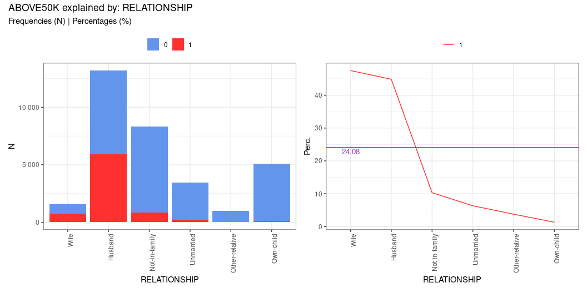

\newpage


###  relationship  [table]

                    N0     N1    Ntot  perc0     perc1     target% 
---------------  -----  -----  ------  --------  --------  --------
Husband           7275   5918   13193  55.143%   44.857%   75.475% 
Not-in-family     7449    856    8305  89.693%   10.307%   10.917% 
Other-relative     944     37     981  96.228%   3.772%    0.472%  
Own-child         5001     67    5068  98.678%   1.322%    0.854%  
Unmarried         3228    218    3446  93.674%   6.326%    2.78%   
Wife               823    745    1568  52.487%   47.513%   9.501%  


\newpage


###  maritalstatus 


 var: MARITALSTATUS 

__IV: 1.339 __

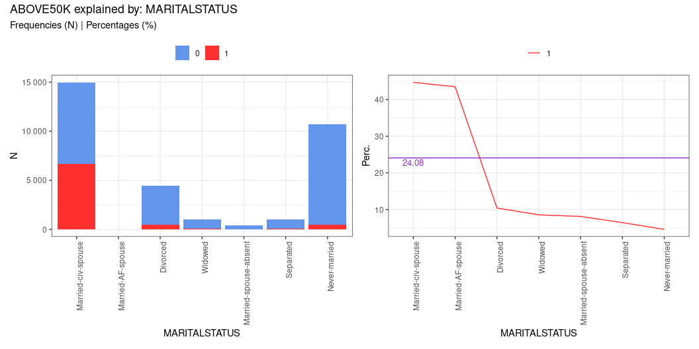

\newpage


###  maritalstatus  [table]

                            N0     N1    Ntot  perc0     perc1     target% 
----------------------  ------  -----  ------  --------  --------  --------
Divorced                  3980    463    4443  89.579%   10.421%   5.905%  
Married-AF-spouse           13     10      23  56.522%   43.478%   0.128%  
Married-civ-spouse        8284   6692   14976  55.315%   44.685%   85.346% 
Married-spouse-absent      384     34     418  91.866%   8.134%    0.434%  
Never-married            10192    491   10683  95.404%   4.596%    6.262%  
Separated                  959     66    1025  93.561%   6.439%    0.842%  
Widowed                    908     85     993  91.44%    8.56%     1.084%  


\newpage


###  age 


 var: AGE 

__IV: 1.218 __

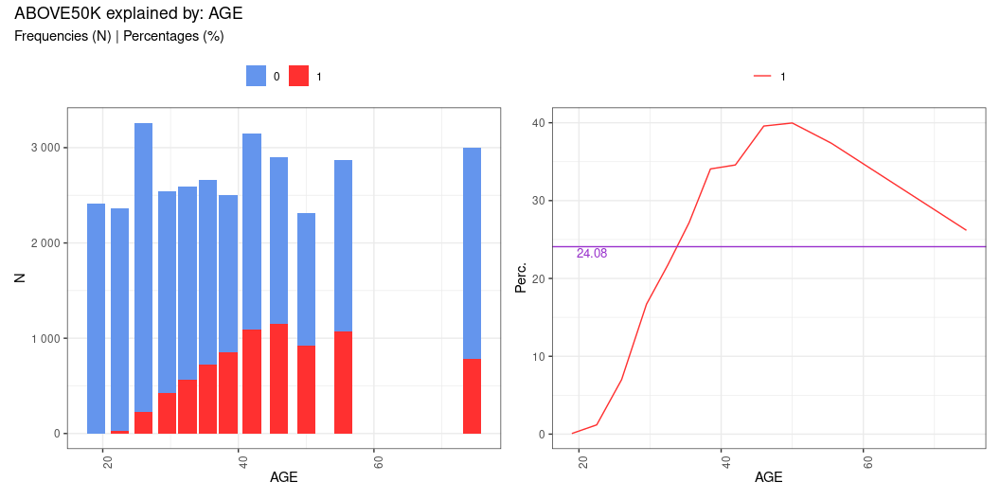

\newpage


###  age  [table]

                       N0     N1   Ntot  perc0     perc1     target% 
------------------  -----  -----  -----  --------  --------  --------
[a] from 17 to 21    2408      2   2410  99.917%   0.083%    0.026%  
[b] from 21 to 24    2334     28   2362  98.815%   1.185%    0.357%  
[c] from 24 to 28    3031    228   3259  93.004%   6.996%    2.908%  
[d] from 28 to 31    2117    424   2541  83.314%   16.686%   5.407%  
[e] from 31 to 34    2028    563   2591  78.271%   21.729%   7.18%   
[f] from 34 to 37    1937    723   2660  72.82%    27.18%    9.221%  
[g] from 37 to 40    1649    852   2501  65.934%   34.066%   10.866% 
[h] from 40 to 44    2062   1090   3152  65.419%   34.581%   13.901% 
[i] from 44 to 48    1754   1149   2903  60.42%    39.58%    14.654% 
[j] from 48 to 52    1391    926   2317  60.035%   39.965%   11.81%  
[k] from 52 to 59    1795   1071   2866  62.631%   37.369%   13.659% 
[l] from 59 to 90    2214    785   2999  73.825%   26.175%   10.011% 


\newpage


###  occupation 


 var: OCCUPATION 

__IV: 0.776 __

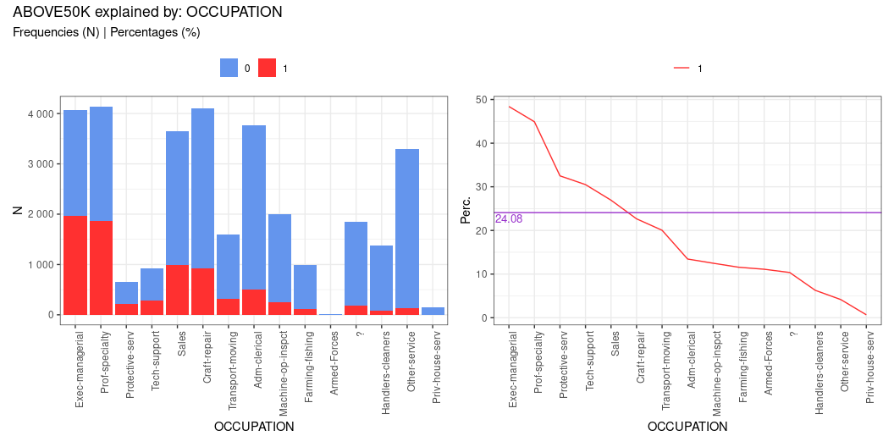

\newpage


###  occupation  [table]

                       N0     N1   Ntot  perc0     perc1     target% 
------------------  -----  -----  -----  --------  --------  --------
?                    1652    191   1843  89.636%   10.364%   2.436%  
Adm-clerical         3263    507   3770  86.552%   13.448%   6.466%  
Armed-Forces            8      1      9  88.889%   11.111%   0.013%  
Craft-repair         3170    929   4099  77.336%   22.664%   11.848% 
Exec-managerial      2098   1968   4066  51.599%   48.401%   25.099% 
Farming-fishing       879    115    994  88.431%   11.569%   1.467%  
Handlers-cleaners    1284     86   1370  93.723%   6.277%    1.097%  
Machine-op-inspct    1752    250   2002  87.512%   12.488%   3.188%  
Other-service        3158    137   3295  95.842%   4.158%    1.747%  
Priv-house-serv       148      1    149  99.329%   0.671%    0.013%  
Prof-specialty       2281   1859   4140  55.097%   44.903%   23.709% 
Protective-serv       438    211    649  67.488%   32.512%   2.691%  
Sales                2667    983   3650  73.068%   26.932%   12.537% 
Tech-support          645    283    928  69.504%   30.496%   3.609%  
Transport-moving     1277    320   1597  79.962%   20.038%   4.081%  


\newpage


###  education 


 var: EDUCATION 

__IV: 0.754 __

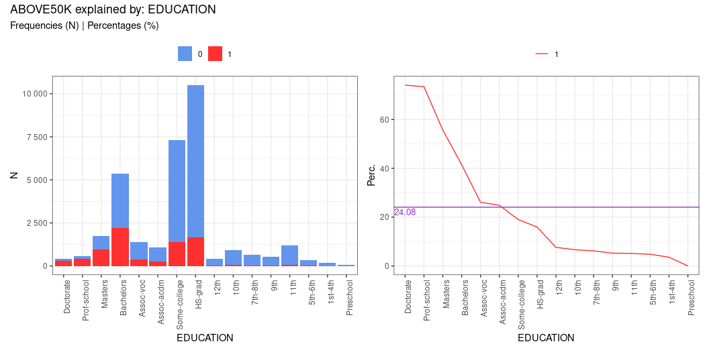

\newpage


###  education  [table]

                  N0     N1    Ntot  perc0     perc1     target% 
-------------  -----  -----  ------  --------  --------  --------
10th             871     62     933  93.355%   6.645%    0.791%  
11th            1115     60    1175  94.894%   5.106%    0.765%  
12th             400     33     433  92.379%   7.621%    0.421%  
1st-4th          162      6     168  96.429%   3.571%    0.077%  
5th-6th          317     16     333  95.195%   4.805%    0.204%  
7th-8th          606     40     646  93.808%   6.192%    0.51%   
9th              487     27     514  94.747%   5.253%    0.344%  
Assoc-acdm       802    265    1067  75.164%   24.836%   3.38%   
Assoc-voc       1021    361    1382  73.878%   26.122%   4.604%  
Bachelors       3134   2221    5355  58.525%   41.475%   28.325% 
Doctorate        107    306     413  25.908%   74.092%   3.903%  
HS-grad         8826   1675   10501  84.049%   15.951%   21.362% 
Masters          764    959    1723  44.341%   55.659%   12.231% 
Preschool         51      0      51  100%      0%        0%      
Prof-school      153    423     576  26.562%   73.438%   5.395%  
Some-college    5904   1387    7291  80.977%   19.023%   17.689% 


\newpage


###  educationnum 


 var: EDUCATIONNUM 

__IV: 0.662 __

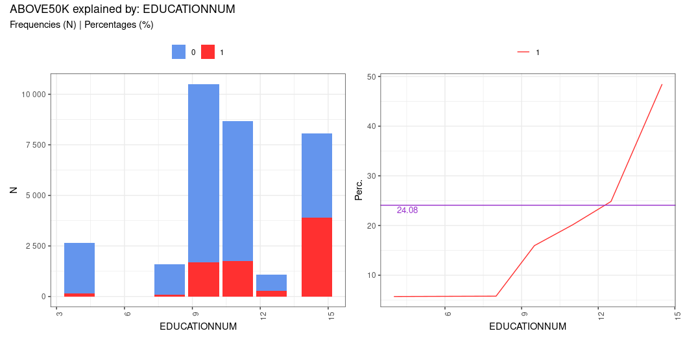

\newpage


###  educationnum  [table]

                       N0     N1    Ntot  perc0     perc1     target% 
------------------  -----  -----  ------  --------  --------  --------
[a] from 1 to 7      2494    151    2645  94.291%   5.709%    1.926%  
[b] from 7 to 9      1515     93    1608  94.216%   5.784%    1.186%  
[c] from 9 to 10     8826   1675   10501  84.049%   15.951%   21.362% 
[d] from 10 to 12    6925   1748    8673  79.845%   20.155%   22.293% 
[e] from 12 to 13     802    265    1067  75.164%   24.836%   3.38%   
[f] from 13 to 16    4158   3909    8067  51.543%   48.457%   49.853% 


\newpage


###  hoursperweek 


 var: HOURSPERWEEK 

__IV: 0.462 __

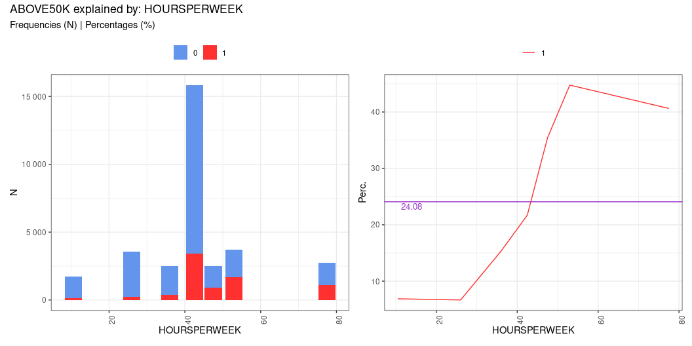

\newpage


###  hoursperweek  [table]

                        N0     N1    Ntot  perc0     perc1     target% 
------------------  ------  -----  ------  --------  --------  --------
[a] from 1 to 20      1587    117    1704  93.134%   6.866%    1.492%  
[b] from 20 to 32     3310    236    3546  93.345%   6.655%    3.01%   
[c] from 32 to 40     2128    385    2513  84.68%    15.32%    4.91%   
[d] from 40 to 45    12398   3437   15835  78.295%   21.705%   43.834% 
[e] from 45 to 50     1615    886    2501  64.574%   35.426%   11.3%   
[f] from 50 to 56     2060   1670    3730  55.228%   44.772%   21.298% 
[g] from 56 to 99     1622   1110    2732  59.37%    40.63%    14.156% 


\newpage


###  sex 


 var: SEX 

__IV: 0.303 __

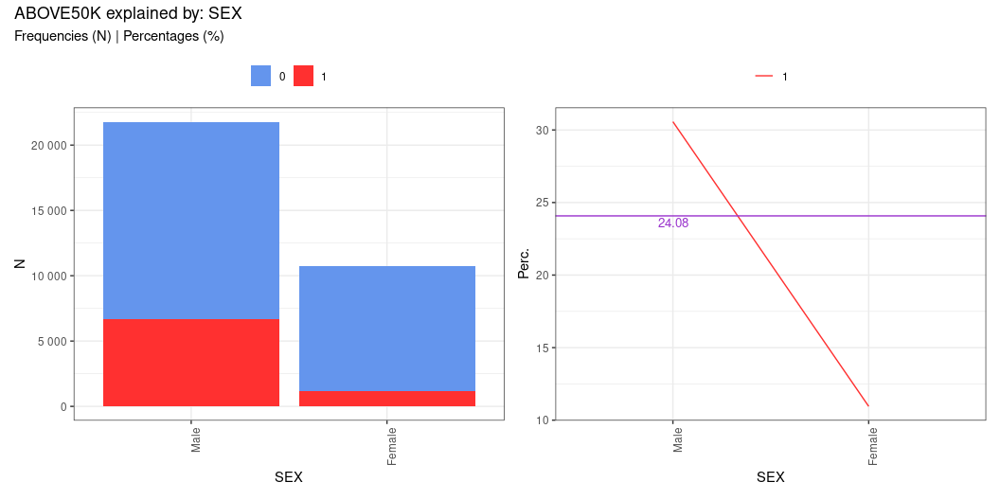

\newpage


###  sex  [table]

             N0     N1    Ntot  perc0     perc1     target% 
-------  ------  -----  ------  --------  --------  --------
Female     9592   1179   10771  89.054%   10.946%   15.036% 
Male      15128   6662   21790  69.426%   30.574%   84.964% 


\newpage


###  workclass 


 var: WORKCLASS 

__IV: 0.167 __

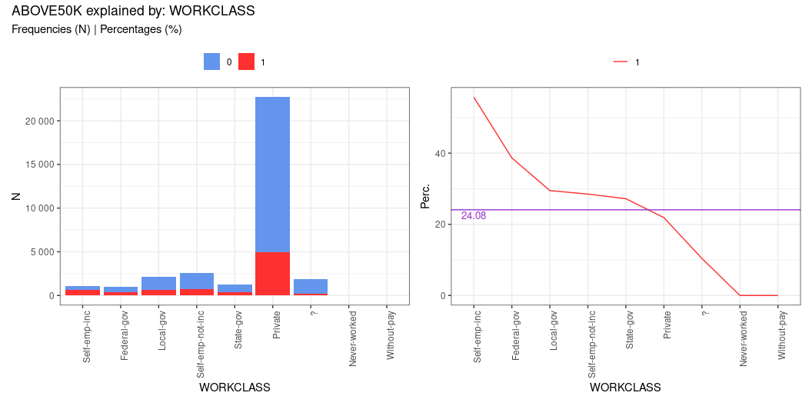

\newpage


###  workclass  [table]

                       N0     N1    Ntot  perc0     perc1     target% 
-----------------  ------  -----  ------  --------  --------  --------
?                    1645    191    1836  89.597%   10.403%   2.436%  
Federal-gov           589    371     960  61.354%   38.646%   4.732%  
Local-gov            1476    617    2093  70.521%   29.479%   7.869%  
Never-worked            7      0       7  100%      0%        0%      
Private             17733   4963   22696  78.133%   21.867%   63.295% 
Self-emp-inc          494    622    1116  44.265%   55.735%   7.933%  
Self-emp-not-inc     1817    724    2541  71.507%   28.493%   9.234%  
State-gov             945    353    1298  72.804%   27.196%   4.502%  
Without-pay            14      0      14  100%      0%        0%      


\newpage


###  nativecountry 


 var: NATIVECOUNTRY 

__IV: 0.081 __

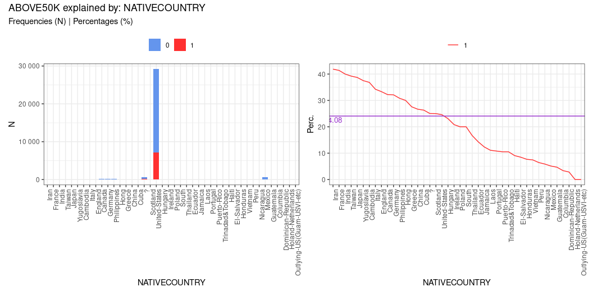

\newpage


###  nativecountry  [table]

                                 N0     N1    Ntot  perc0     perc1     target% 
---------------------------  ------  -----  ------  --------  --------  --------
?                               437    146     583  74.957%   25.043%   1.862%  
Cambodia                         12      7      19  63.158%   36.842%   0.089%  
Canada                           82     39     121  67.769%   32.231%   0.497%  
China                            55     20      75  73.333%   26.667%   0.255%  
Columbia                         57      2      59  96.61%    3.39%     0.026%  
Cuba                             70     25      95  73.684%   26.316%   0.319%  
Dominican-Republic               68      2      70  97.143%   2.857%    0.026%  
Ecuador                          24      4      28  85.714%   14.286%   0.051%  
El-Salvador                      97      9     106  91.509%   8.491%    0.115%  
England                          60     30      90  66.667%   33.333%   0.383%  
France                           17     12      29  58.621%   41.379%   0.153%  
Germany                          93     44     137  67.883%   32.117%   0.561%  
Greece                           21      8      29  72.414%   27.586%   0.102%  
Guatemala                        61      3      64  95.312%   4.688%    0.038%  
Haiti                            40      4      44  90.909%   9.091%    0.051%  
Holand-Netherlands                1      0       1  100%      0%        0%      
Honduras                         12      1      13  92.308%   7.692%    0.013%  
Hong                             14      6      20  70%       30%       0.077%  
Hungary                          10      3      13  76.923%   23.077%   0.038%  
India                            60     40     100  60%       40%       0.51%   
Iran                             25     18      43  58.14%    41.86%    0.23%   
Ireland                          19      5      24  79.167%   20.833%   0.064%  
Italy                            48     25      73  65.753%   34.247%   0.319%  
Jamaica                          71     10      81  87.654%   12.346%   0.128%  
Japan                            38     24      62  61.29%    38.71%    0.306%  
Laos                             16      2      18  88.889%   11.111%   0.026%  
Mexico                          610     33     643  94.868%   5.132%    0.421%  
Nicaragua                        32      2      34  94.118%   5.882%    0.026%  
Outlying-US(Guam-USVI-etc)       14      0      14  100%      0%        0%      
Peru                             29      2      31  93.548%   6.452%    0.026%  
Philippines                     137     61     198  69.192%   30.808%   0.778%  
Poland                           48     12      60  80%       20%       0.153%  
Portugal                         33      4      37  89.189%   10.811%   0.051%  
Puerto-Rico                     102     12     114  89.474%   10.526%   0.153%  
Scotland                          9      3      12  75%       25%       0.038%  
South                            64     16      80  80%       20%       0.204%  
Taiwan                           31     20      51  60.784%   39.216%   0.255%  
Thailand                         15      3      18  83.333%   16.667%   0.038%  
Trinadad&Tobago                  17      2      19  89.474%   10.526%   0.026%  
United-States                 21999   7171   29170  75.417%   24.583%   91.455% 
Vietnam                          62      5      67  92.537%   7.463%    0.064%  
Yugoslavia                       10      6      16  62.5%     37.5%     0.077%  


\newpage


###  race 


 var: RACE 

__IV: 0.069 __

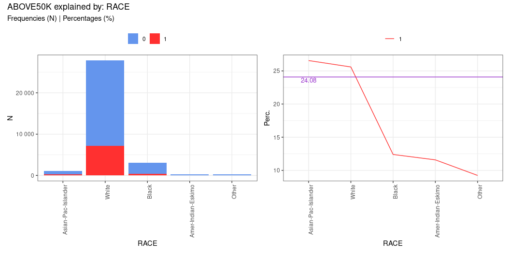

\newpage


###  race  [table]

                         N0     N1    Ntot  perc0     perc1     target% 
-------------------  ------  -----  ------  --------  --------  --------
Amer-Indian-Eskimo      275     36     311  88.424%   11.576%   0.459%  
Asian-Pac-Islander      763    276    1039  73.436%   26.564%   3.52%   
Black                  2737    387    3124  87.612%   12.388%   4.936%  
Other                   246     25     271  90.775%   9.225%    0.319%  
White                 20699   7117   27816  74.414%   25.586%   90.766% 


\newpage


###  fnlwgt 


 var: FNLWGT 

__IV: 0.01 __

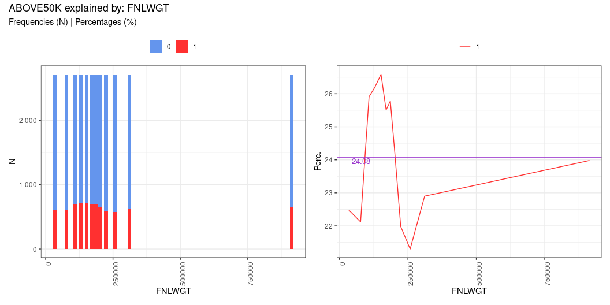

\newpage


###  fnlwgt  [table]

                                N0    N1   Ntot  perc0     perc1     target% 
---------------------------  -----  ----  -----  --------  --------  --------
[a] from 12285 to 55900       2104   610   2714  77.524%   22.476%   7.78%   
[b] from 55900 to 98253       2113   600   2713  77.884%   22.116%   7.652%  
[c] from 98253 to 117827      2010   703   2713  74.088%   25.912%   8.966%  
[d] from 117827 to 141067     2003   711   2714  73.803%   26.197%   9.068%  
[e] from 141067 to 162343     1991   721   2712  73.414%   26.586%   9.195%  
[f] from 162343 to 178356     2021   692   2713  74.493%   25.507%   8.825%  
[g] from 178356 to 193160     2015   700   2715  74.217%   25.783%   8.927%  
[h] from 193160 to 210474     2053   657   2710  75.756%   24.244%   8.379%  
[i] from 210474 to 237051     2119   597   2716  78.019%   21.981%   7.614%  
[j] from 237051 to 279465     2136   578   2714  78.703%   21.297%   7.372%  
[k] from 279465 to 342730     2091   621   2712  77.102%   22.898%   7.92%   
[l] from 342730 to 1484705    2064   651   2715  76.022%   23.978%   8.303%  
